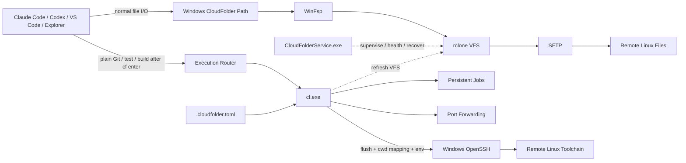

# CloudFolder

[](https://github.com/EurekaZang/CloudFolder/releases)
[](https://github.com/EurekaZang/CloudFolder/actions/workflows/ci.yml)
[](https://github.com/EurekaZang/CloudFolder/releases)
[](LICENSE)

**[中文](README.md) | [English](README.en.md) | [日本語](README.ja.md)**

> # Mount the server. Keep the Agent local.
>
> **Turn a remote Linux workspace into a local Windows folder without redeploying your coding agent.**

CloudFolder is a Windows **Remote Workspace Layer for AI coding agents and Linux development**.

It exposes a remote SSH/SFTP directory as an ordinary Windows path that Claude Code, Codex, VS Code, Explorer, and other local applications can read and edit. Enter that workspace with `cf enter` and Git, tests, builds, package managers, Python, and common Linux tooling are transparently routed to the matching remote Linux cwd, while local tools such as Explorer and `code .` stay local.

```text
Remote Linux: /home/alice/robotics
                    │
                    │ SFTP
                    ▼
Windows: C:\Users\Alice\CloudFolder\Lab\robotics
                    │
       ┌────────────┴────────────┐
       │                         │
       ▼                         ▼
Claude Code / Codex          cf run -- pytest -q
local file access            same remote cwd on Linux
```

**There is no CloudFolder daemon to install on the server, and there is no need to deploy another Claude Code or Codex instance there.** If the machine provides SSH/SFTP, CloudFolder can connect the workspace to your local environment.

> Current beginner-friendly target: **Windows 10/11 x64 + SSH/SFTP Linux servers**.

---

## CloudFolder in 15 seconds

Remote development usually forces one of four compromises:

1. **Install the agent on every server** — repeat agent login, permissions, Skills, MCP, environment setup, and version management on every machine.
2. **Mount SFTP/SSHFS only** — files become local-looking, but Git/build/test/package-manager workloads can be slow over a network filesystem and there is no unified local-cwd → remote-cwd execution model.
3. **Use a Remote-SSH IDE** — excellent remote development inside that IDE, but the workspace lives in an editor-specific remote context rather than as an ordinary system-wide Windows path for every local tool.
4. **Synchronize copies** — now there is a local copy and a remote copy, with synchronization direction, timestamps, conflicts, and source-of-truth questions.

CloudFolder takes a fifth approach:

> **Keep the filesystem interface with the local agent. Keep the execution environment on remote Linux. Make both refer to the same workspace.**

That is the product distinction.

### Quick navigation

- **See it first:** [30-second demo](#30-second-demo)
- **Why not SSHFS/rclone alone:** [How does CloudFolder compare?](#how-does-cloudfolder-compare)
- **Install it:** [Install in three steps](#install-in-three-steps)
- **Use it with agents:** [Teach Claude Code / Codex once](#teach-claude-code--codex-once)
- **Command reference:** [`cf.exe` reference](#cfexe-reference)
- **Something broke:** [Troubleshooting](#troubleshooting)

### Is CloudFolder for you right now?

**Strong fit:** Windows is your primary desktop, Claude Code/Codex/IDE runs locally, while the project, Linux toolchain, GPU, or data lives on an SSH server.

**Probably unnecessary:** you work exclusively inside VS Code Remote-SSH, or what you actually need is a full offline synchronization/mirroring product rather than a live remote filesystem.

---

# CloudFolder is not mainly a mount. It is a consistency layer.

Many excellent tools can already make SFTP appear as a Windows drive.

The harder developer problem is this sequence:

```text
Agent edits a file
    ↓
VFS may still be writing it back asynchronously
    ↓
pytest / git / cargo / cmake starts remotely
    ↓
the remote command must see the edit
    ↓
the command must run in the exact Linux directory corresponding to local cwd
    ↓
new remote artifacts must become visible in the local view
```

A generic mount plus `ssh host command` does not automatically guarantee the whole chain.

CloudFolder therefore defines a **Workspace Consistency Contract**:

1. **Resolve the mount** — identify which CloudFolder workspace owns the Windows path.
2. **Map the cwd** — deterministically map the local relative path onto the saved absolute Linux root.
3. **Flush barrier** — wait for queued/in-progress rclone VFS writes to reach zero before remote execution.
4. **Strict SSH execution** — use the pinned key, `known_hosts`, and strict host verification.
5. **Preserve exit status** — routed commands and explicit `cf run` return the remote program's exit code.
6. **Refresh the view** — invalidate the VFS directory view after execution so remote-generated artifacts appear locally.

> **The key CloudFolder feature is not “SFTP also mounts.” It is making the local filesystem plane and remote execution plane behave like one development workspace.**

---

# 30-second demo

Map:

```text
alice@server.example.com:/home/alice/projects
```

to:

```text
C:\Users\Alice\CloudFolder\Lab
```

Then:

```powershell
# Enter a remote project through an ordinary Windows path.
cd (cf path Lab)
cd robotics
cf enter

# Runtime commands transparently execute on remote Linux in the matching cwd.
git status
pytest -q
cargo test

# Local Windows applications still stay local and inherit the routed session.
code .
codex
# or: claude

# Explicit APIs remain available for scripts and shell syntax.
cf run -- git status
cf sh -- "git status && pytest -q"
```

If Windows cwd is:

```text
C:\Users\Alice\CloudFolder\Lab\robotics\src
```

and the mount's remote root is:

```text
/home/alice/projects
```

then plain routed:

```powershell
bash -lc pwd
```

runs in:

```text
/home/alice/projects/robotics/src
```

No manual mental mapping between a Windows project path and a remote shell path.

---

# v0.7: Local Workspace / Remote Runtime

CloudFolder v0.7 completes the abstraction that the mount alone could not provide: **files are locally addressable, but the workspace runtime is remote by default**.

## 1. Execution Router — stop thinking about `cf run`

```powershell
cf enter GPU-Server

git status
uv sync
pytest -q
python train.py
cargo test
rg "TODO"
```

`cf enter` starts a local PowerShell with native `cf.exe` hardlink shims for Git, Python, test runners, package managers, compilers, build tools, and common Linux utilities. Windows argv and Unicode are preserved without rebuilding commands as shell strings. `dir`, `cd`, `explorer .`, `code .`, and other local tools are not routed.

Every routed command still follows the Workspace Consistency Contract: flush pending VFS writes → map Windows cwd to Linux cwd → load the workspace environment → execute remotely → preserve the exit code → refresh the local view.

**Formal Gate:** a fresh workspace completed `git status → local edit → test → git add → git commit` using only ordinary `git` / `python` commands and **zero proactive `cf run` commands**.

## 2. Workspace Environment — configure Conda / modules / CUDA once

Put `.cloudfolder.toml` at the project root:

```toml
[environment]
shell = "bash -lc"
init = """
source ~/.bashrc
conda activate isaaclab
module load cuda/12.4
"""

[environment.profiles.gpu1]
init = """
export CUDA_VISIBLE_DEVICES=1
"""
```

Then:

```powershell
cf env
cf env use gpu1
cf env reload
```

The base `init` plus the selected profile are applied to routed commands, explicit `cf run` / `cf sh`, `cf shell`, and persistent jobs. `cf env use` stores a local selection and does not rewrite the committed project config. See [`config/workspace.toml.example`](config/workspace.toml.example).

## 3. Persistent Jobs — remote compute survives the laptop

```powershell
cf job run -- python train.py
cf job list
cf job logs cf-a83f1234
cf job logs -f cf-a83f1234
cf job attach cf-a83f1234
cf job stop cf-a83f1234
```

Job PID, cwd, command, state, and logs live remotely under `~/.cloudfolder/jobs/`. The first backend uses `setsid + nohup` (falling back to `nohup`), so losing SSH, restarting CloudFolder, or shutting down the local PC does not terminate the remote task. `attach` currently reconnects to the durable live log stream; it does not pretend arbitrary interactive stdin can be reconstructed.

## 4. Port Forwarding — Jupyter without hand-written `ssh -L`

```powershell
# Jupyter is listening on remote 127.0.0.1:8888
cf forward 8888

cf forward list
cf forward stop 8888
```

If the same local port is busy, CloudFolder chooses a free loopback port and prints the final endpoint. Tunnels bind to `127.0.0.1`, run in an independent OpenSSH process, and persist local PID/port state. Before stopping a tunnel, CloudFolder verifies the process command line so a recycled PID cannot kill an unrelated process.

## 5. Native SSH Config / ProxyJump — adopt the connection you already use

Given:

```sshconfig
Host h100
    HostName 10.0.0.23
    User zang
    IdentityFile ~/.ssh/id_ed25519
    ProxyJump gateway
```

use:

```powershell
cf add h100
```

Foreground CloudFolder commands keep Windows OpenSSH responsible for aliases, `ProxyJump`, `ProxyCommand`, custom user/port, identities, certificates, `known_hosts`, and `Include`. The background LocalSystem SFTP mount freezes the `ssh -G`-resolved target/jump chain into a mount-private SYSTEM-safe snapshot instead of weakening the user's original private-key permissions.

> **Formal Gate: If `ssh <host>` works, `cf add <host>` should work.**

The live gate used the port-22 machine as a bastion and reached the port-6000 `eureka` host through `ProxyJump`; the LocalSystem service reached `Running / Mounted / PendingWrites=0`, survived a runtime upgrade with its private-key ACL still restricted to SYSTEM + Administrators, and was then removed cleanly.

Unattended service startup must still succeed in OpenSSH `BatchMode`. CloudFolder does not store password-only credentials or credentials that exist only in a transient interactive agent session.

---

# Why is there a missing layer without CloudFolder?

Remote development actually contains four separate problems. Most tools intentionally solve only some of them.

## 1. Namespace: make the remote workspace part of the local namespace

For local agents and applications, this is the most universal interface:

```text
C:\Users\Alice\CloudFolder\Lab\repo\src\main.py
```

A system path works with programs that understand normal Windows file APIs, not only one editor's remote-workspace abstraction.

## 2. Execution locality: heavy work belongs on the server

A remote project often depends on:

- Linux toolchains;
- CUDA / GPUs;
- server-side Python / Conda / uv environments;
- Docker;
- large memory;
- datasets that are not local;
- existing build caches and dependencies.

So “let the local agent see the files” should not mean “move every command back to Windows.”

CloudFolder deliberately splits the work:

| Work | Recommended location |
|---|---|
| Targeted reads/edits | Local CloudFolder path |
| Create/rename/delete files | Local CloudFolder path |
| Small targeted search | Local or remote |
| Git | Plain `git ...` inside `cf enter` |
| pytest / cargo / cmake / npm / uv | Plain commands inside `cf enter` |
| Repository-wide `rg` / `find` | Plain routed `rg` / `find` inside `cf enter` |
| Scripts tied to server environments | Routed commands, or explicit `cf run -- ...` outside an entered session |
| Pipelines / redirects | Routed shell or explicit `cf sh -- "..."` |

This is not a workaround around the filesystem. It is an explicit acknowledgment that **SFTP network semantics are not local NVMe semantics**.

## 3. Lifecycle: a mount should be infrastructure, not a terminal process

The desired experience is:

> “I configured it yesterday. It is still there after reboot. A network interruption recovers. A crashed mount process does not make me rebuild the command line.”

CloudFolder uses a Rust Windows Service to supervise mounts rather than requiring a permanent interactive `rclone mount` terminal.

## 4. Agent awareness: the agent needs the local-vs-remote rule

Opt in once:

```powershell
cf agent setup
```

CloudFolder maintains only its own managed block in:

```text
%USERPROFILE%\.claude\CLAUDE.md
%USERPROFILE%\.codex\AGENTS.md
```

Existing user instructions are preserved.

The rule becomes simple:

> **Start the agent from `cf enter`, edit through the local filesystem, and use ordinary Git/build/test/repository-wide commands. Do not start a second coding agent remotely just for this workspace.**

---

# How does CloudFolder compare?

CloudFolder does not claim to have invented SSH, SFTP, FUSE, or remote development. It intentionally builds on mature infrastructure.

The difference is the **product abstraction**.

| Solution | What it is best at | File presentation | Command execution | Local-agent model | Main trade-off |
|---|---|---|---|---|---|
| **CloudFolder** | **Agent-native remote workspace** | Ordinary Windows path | `cf enter` transparently routes runtime tools to the same remote cwd; `cf run` remains explicit fallback | **Agent stays local; files are locally addressable; heavy work stays remote** | Beginner UI is currently focused on Windows + SFTP |
| [SSHFS-Win](https://github.com/winfsp/sshfs-win) | SSHFS mounting on Windows | Windows drive / UNC | User manages SSH separately | Local agent can see the mount; execution plane is left to the user | Officially a minimal SSHFS port; developer workflow orchestration is not its purpose |
| [rclone mount + WinFsp](https://rclone.org/commands/rclone_mount/) | General remote/VFS mount engine | Windows filesystem | User designs the execution path | Can provide the file plane, but cwd bridge, flush contract, service lifecycle, and agent policy are separate work | Powerful and flexible infrastructure rather than an opinionated developer product |
| [RaiDrive](https://docs.raidrive.com/en/) / [ExpanDrive](https://docs.expandrive.com/integrations/sftp) / [Mountain Duck](https://docs.cyberduck.io/mountainduck/) | Polished cloud/SFTP desktop mounting | Explorer / drive / integrated folder | Mapped-cwd remote developer execution is not their core abstraction | Excellent general file-access products | CloudFolder is narrower and specifically couples coding-agent file access to Linux execution |
| [VS Code Remote - SSH](https://code.visualstudio.com/docs/remote/ssh) | Full remote IDE experience | VS Code remote workspace | Remote | Excellent inside VS Code | Installs VS Code Server remotely; the workspace is primarily a VS Code remote context rather than a system-wide Windows path |
| [WinSCP Sync](https://winscp.net/eng/docs/task_synchronize) | File transfer and synchronization | Local copy + remote copy | User decides | Agent can work on the local copy | Two copies and synchronization semantics instead of one live remote filesystem |

## SSHFS-Win vs CloudFolder

If the requirement is simply:

> “Give me an SFTP drive letter.”

SSHFS-Win is already a direct, mature answer.

CloudFolder targets a more specific workflow:

> “Let my local agent treat a Linux project as a local workspace, transparently route Git/Linux/toolchain commands back to the exact remote cwd, and keep the mount alive as infrastructure.”

CloudFolder is not meant to replace every SSHFS-Win use case. It targets a higher-level **remote development / local agent** workflow.

## rclone + WinFsp vs CloudFolder

CloudFolder itself uses **rclone + WinFsp**. The official rclone `mount` documentation also states that on Windows a mount runs in foreground mode and `--daemon` is ignored. CloudFolder therefore treats Windows Service hosting, supervision, recovery, and mount lifecycle as part of the product layer rather than leaving process hosting to the user.

You can build much of the stack yourself if you want to maintain:

- rclone configuration;
- WinFsp installation;
- startup;
- Windows services;
- crash recovery;
- health probes;
- RC endpoints;
- cache policy;
- stale-mount cleanup;
- SSH key and `known_hosts` handling;
- Windows ACLs;
- local cwd → remote cwd mapping;
- VFS write flush barriers;
- exit-code propagation;
- post-execution cache refresh;
- agent instructions.

**CloudFolder exists because developing on a Linux server should not first require becoming a Windows filesystem-integration engineer.**

## VS Code Remote-SSH vs CloudFolder

VS Code Remote-SSH is an excellent remote IDE and is not mutually exclusive with CloudFolder.

Its model is roughly:

```text
Local VS Code UI
      ↕
Remote VS Code Server + remote extensions + remote commands
```

CloudFolder's model is:

```text
Any local App / Agent
      ↕ normal filesystem API
Windows CloudFolder path
      ↕
actual remote files

Local Agent
      ↕ cf enter / Execution Router
actual remote Linux toolchain
```

If VS Code is your only environment, Remote-SSH may already be enough.

If you want **Codex, Claude Code, Explorer, other IDEs, scripts, and desktop applications to share the same ordinary Windows workspace without moving the agent itself to the server**, CloudFolder provides that abstraction directly.

## Sync tools vs CloudFolder

Sync model:

```text
local copy  ⇄  remote copy
```

CloudFolder model:

```text
local filesystem view  →  remote source of truth
```

The trade-off is explicit: **CloudFolder is a live remote filesystem, not an offline mirror.**

---

# WinFsp is not a competitor, and rclone is not something CloudFolder replaces

```text
CloudFolder product / workflow layer
              │
        ┌─────┴─────┐
        │           │
      rclone      WinFsp
        │           │
      SFTP      Windows FS bridge
```

- **WinFsp** provides Windows userspace-filesystem infrastructure.
- **rclone** provides the remote-storage / VFS mount engine.
- **CloudFolder** provides installation, configuration, security, lifecycle, recovery, developer CLI, agent guidance, and the file/execution consistency layer.

The project deliberately composes mature components instead of inventing a new SSH stack.

---

# Who benefits most?

## Local Claude Code / Codex + remote GPU server

Keep the local machine's agent login, Skills, MCP, browser/GitHub context, and desktop tools. Keep CUDA, datasets, Docker, and Linux dependencies on the server.

## Developers working across many servers

```text
C:\Users\Alice\CloudFolder\
├── Lab-A
├── Lab-B
├── GPU-4090
├── GPU-H100
└── Aliyun
```

Each server becomes a workspace root rather than a separate remote-agent installation project.

## Research / robotics / ML

A common setup is Windows for the daily desktop and Linux for GPU compute, simulators, datasets, and experiments. CloudFolder is designed around that **local interaction + remote compute** split.

## Teams that do not want every server to become a full developer desktop

The server keeps doing what it is good at:

```text
sshd + Linux toolchain + compute/data
```

No CloudFolder daemon is required remotely.

---

# Install in three steps

1. Open the latest [GitHub Release](https://github.com/EurekaZang/CloudFolder/releases) and download `CloudFolder-windows-x64.zip`.
2. Extract it.
3. Double-click **`Install CloudFolder.cmd`**.

Setup requests elevation once and installs the CloudFolder runtime, WinFsp, and rclone.

It then asks for normal SSH information:

- friendly name, e.g. `Lab Server`;
- hostname or IP;
- SSH port, default `22`;
- SSH username;
- remote directory, blank for the SSH user's home;
- local Windows directory, with a sensible default.

If the server does not yet trust the CloudFolder key:

1. Windows OpenSSH displays the host fingerprint.
2. You confirm the host.
3. OpenSSH asks for the SSH password once.
4. CloudFolder installs the public key.
5. Mount services use key authentication afterward.

**CloudFolder does not capture or store the SSH password.**

No CloudFolder binary is installed on the server.

### PowerShell bootstrap

```powershell
iwr https://raw.githubusercontent.com/EurekaZang/CloudFolder/main/install.ps1 -OutFile "$env:TEMP\install-cloudfolder.ps1"
powershell -ExecutionPolicy Bypass -File "$env:TEMP\install-cloudfolder.ps1"
```

The bootstrap reads the latest GitHub Release, downloads the ZIP and SHA-256 file, verifies the package, and starts the same elevated installer.

After setup, use:

```text
Start Menu → CloudFolder → CloudFolder Manager
```

or open a new terminal and use `cf`.

---

# `cf.exe` reference

```text
cf list
cf path <mount>
cf here
cf status [mount]
cf enter [mount]
cf env [use <profile>|reload]
cf job run|list|logs|attach|stop ...
cf forward <remote-port> [local-port]
cf forward list|stop ...
cf add <ssh-config-host>
cf flush [mount]
cf refresh [mount]
cf run [mount] -- <program> [args...]
cf sh [mount] -- <shell command>
cf shell [mount]
cf agent setup|status|remove
```

### `cf list`

List configured mounts.

### `cf path <mount>`

Print a mount's Windows path, useful from PowerShell:

```powershell
cd (cf path Lab)
```

### `cf here`

Resolve the current mount, local root/cwd, and matching remote cwd.

### `cf status [mount]`

Show service state, mount state, pending writes, local root, and remote root.

### `cf enter [mount]`

Enter the Local Workspace / Remote Runtime session. Common runtime tools become transparent remote commands; local Windows tools stay local.

### `cf env [use <profile>|reload]`

Inspect or select the `.cloudfolder.toml` workspace environment used by routed commands, explicit remote commands, shells, and persistent jobs.

### `cf job ...`

Run and recover detached remote jobs. State and logs live under remote `~/.cloudfolder/jobs/`.

### `cf forward ...`

Create/list/stop localhost SSH tunnels for Jupyter, TensorBoard, Gradio, debuggers, databases, and similar services.

### `cf add <ssh-config-host>`

Adopt an existing Windows OpenSSH config alias, including ProxyJump/ProxyCommand paths. Formal Gate: if `ssh <host>` works non-interactively, `cf add <host>` should work.

### `cf flush [mount]`

Wait until VFS queued/in-progress writes are zero.

### `cf refresh [mount]`

Invalidate the VFS directory view.

### `cf run [mount] -- <program> [args...]` — explicit/legacy API

Use outside `cf enter`, or when a script intentionally wants explicit remote execution with native argv and no shell parsing:

```powershell
cf run -- git status
cf run -- pytest -q
cf run -- python scripts/train.py --config configs/a.yaml
```

Flow:

```text
flush → map cwd → strict SSH → exec argv → preserve exit code → refresh
```

### `cf sh [mount] -- <shell command>`

Use when shell operators, pipelines, redirects, or variables are needed:

```powershell
cf sh -- "git status && pytest -q"
cf sh -- "rg TODO src | head -50"
```

### `cf shell [mount]`

Open an interactive remote login shell in the mapped remote cwd.

You may specify the mount explicitly when outside a mounted directory:

```powershell
cf run Lab -- git status
cf shell Lab
```

---

# Teach Claude Code / Codex once

```powershell
cf agent setup
```

CloudFolder updates only its managed block in:

```text
%USERPROFILE%\.claude\CLAUDE.md
%USERPROFILE%\.codex\AGENTS.md
```

It teaches the agents to:

- edit through normal local filesystem tools;
- start from `cf enter` when possible;
- use ordinary routed Git/build/test/package-manager/compiler/interpreter commands;
- keep repository-wide `rg` / `find` on the remote runtime;
- use explicit `cf run` / `cf sh` only when scripting or bypassing the entered-session routing model;
- avoid launching a second remote coding agent solely for this workspace.

This is explicitly opt-in. Existing instructions are preserved.

```powershell
cf agent status
cf agent remove
```

---

# Architecture: three planes, one workspace



```text
Data plane:       Windows path → WinFsp → rclone VFS → SFTP → remote files
Execution plane:  cf enter → routed tool → cf.exe → SSH → matching Linux cwd
Control plane:    CloudFolderService → health / restart / backoff / cleanup
Runtime plane:    .cloudfolder.toml + persistent jobs + localhost forwards
Agent plane:      Claude/Codex guidance → local file I/O + transparent remote runtime
```

---

# Reliability layer

Current mount supervision includes:

- one Windows Service per mount for fault isolation;
- child-process liveness checks;
- a separate killable filesystem health probe so a hung filesystem call cannot hang the watchdog itself;
- automatic rclone replacement after abnormal exit;
- bounded exponential reconnect backoff with jitter;
- Windows SCM recovery;
- Windows **Job Object + `KILL_ON_JOB_CLOSE`** to prevent orphan rclone processes;
- graceful rclone RC shutdown with PID verification;
- stale reparse-point cleanup;
- refusal to hide/overwrite a non-empty normal directory at the mount path;
- independent RC port, cache, and logs per mount;
- bounded VFS cache and minimum-free-space protection;
- safe stop/upgrade/restore around shared runtime upgrades.

> **A mount should exist as infrastructure, not merely be running in somebody's terminal.**

---

# Default Dev profile

- Local root: `%USERPROFILE%\CloudFolder\<name>`
- Dedicated key: `%USERPROFILE%\.ssh\cloudfolder_ed25519`
- Backend: SFTP
- VFS cache mode: `full`
- Cache maximum: `8 GiB`
- Minimum free space: `5 GiB`
- Developer write-back: `1s`
- Routed commands, explicit remote commands, and job startup all use the flush barrier
- Concurrent VFS uploads: `8`
- Health probe: every `10s`
- Probe timeout: `5s`
- Recycle after 3 consecutive probe failures
- rclone idle SFTP connection: `20s`
- Windows Service startup: Automatic (Delayed)

Advanced users can edit generated configuration under:

```text
C:\ProgramData\CloudFolder\mounts\<name>\
```

and restart the matching `CloudFolder.<name>` service.

---

# Security model

## Host verification

Before installing the public key, Windows OpenSSH shows the server fingerprint. Later connections use strict host checking and the mount's explicit `known_hosts` metadata.

Routed commands, `cf run`, `cf sh`, `cf shell`, jobs, and forwards use the same strict SSH identity information. SSH Config mounts additionally use a mount-private SYSTEM-safe service snapshot for the background SFTP process.

## Password handling

The SSH password may be entered once directly into Windows OpenSSH while authorizing the key. CloudFolder does not write the password into rclone config, TOML, logs, environment variables, or command-line arguments.

## Unattended key trade-off

A Windows Service cannot type an interactive private-key passphrase after every reboot. CloudFolder therefore creates a dedicated **unencrypted SSH private key** by default and protects it with Windows ACLs.

This is an explicit reliability/security trade-off rather than hidden behavior.

## Windows filesystem ACL

Mount services run as LocalSystem for reliable startup and SCM recovery. CloudFolder generates per-user WinFsp `FileSecurity` so the installing user's SID is filesystem owner with FullControl; LocalSystem and Administrators retain FullControl. It does not grant Everyone FullControl.

See [SECURITY.md](SECURITY.md).

---

# Performance: do not pretend a network filesystem is local NVMe

CloudFolder deliberately does **not** promise local-NTFS latency for every workload.

SFTP round trips, server latency, directory size, file count, and VFS cache state still matter.

Git is a useful example: it performs many small metadata/object accesses under `.git`, so a cold mounted repository can amplify network round trips.

CloudFolder's performance model is therefore:

```text
low fan-out / editing I/O  → local filesystem path
high fan-out / compute     → remote execution
```

That is why **remote execution locality** is a core feature rather than an SSH shortcut added on the side. In v0.7 the normal interactive form is transparent routing through `cf enter`; `cf run` remains the explicit API.

---

# CloudFolder Manager

The interactive manager intentionally stays small:

```text
1. Add a remote folder
2. Open a folder
3. Restart a mount
4. Remove a mount
5. Doctor / troubleshoot
6. Open logs
7. Exit
```

Removing a mount removes the local mount/service configuration, **not remote files**.

The VFS cache is preserved by default because after a network failure it may still contain the last copy of a write that has not reached the server. Cache roots are removed only with explicit purge behavior such as `Uninstall -PurgeCache`.

---

# Troubleshooting

Open:

```text
CloudFolder Manager → Doctor / troubleshoot
```

Doctor checks:

- CloudFolder service engine;
- rclone;
- WinFsp;
- Windows OpenSSH;
- configured Windows Services;
- local mount points;
- fresh strict SFTP connectivity.

Logs:

```text
C:\ProgramData\CloudFolder\logs\
```

Useful CLI diagnostics:

```powershell
cf status
cf here
cf flush
cf refresh
```

---

# Current boundaries

CloudFolder keeps its scope intentionally narrow today.

- The beginner-friendly manager currently focuses on **SFTP**. rclone supports many more backends, but they are not all exposed in the simple UI.
- CloudFolder is a **live remote filesystem**, not an offline synchronization mirror.
- Network and server latency still exist.
- Git, package managers, and cold repository-wide scans can still be slow if executed by a process that did not inherit the Execution Router. Start terminals, coding agents, and `code .` from `cf enter`; use explicit `cf run` / `cf sh` as the fallback for unlisted third-party CLIs and automation.
- The Execution Router deliberately uses an explicit runtime-tool shim set rather than guessing every executable.
- Persistent Jobs currently use `setsid + nohup`; `cf job attach` follows durable logs and does not restore arbitrary interactive stdin. Scheduler-managed HPC jobs should still use Slurm/PBS/etc.
- `cf forward` is explicit port forwarding. It does not yet parse arbitrary application stdout to auto-discover ports.
- SSH Config / ProxyJump mounts require credentials that work for unattended OpenSSH `BatchMode`; CloudFolder does not persist password-only or transient agent-only credentials.
- POSIX permissions/ownership cannot always map perfectly to Windows filesystem semantics.
- The current rclone SFTP projection does not preserve Linux symlink identity as native Windows symlinks.
- Releases are currently **not Authenticode-signed**, so Windows SmartScreen may show an unknown-publisher warning. SHA-256 checksum files are released with the ZIP.
- The current product target is Windows local-agent → Linux SSH/SFTP workspace; macOS/Linux clients are not the focus of this release line.

These limitations are documented because the goal is a reliable specific workflow, not an inflated feature checklist.

---

# FAQ

### Does CloudFolder sync a complete copy of the repository to Windows?

No. The Windows path is a live view of the remote filesystem. rclone VFS uses local caching to provide filesystem behavior, but CloudFolder is not a conventional full-project sync mirror.

### Does the server need root or a CloudFolder daemon?

No CloudFolder daemon is installed remotely. A normal SSH/SFTP account with permission to the target directory is enough. Initial public-key authorization requires the account to be able to use its SSH authorized-keys environment normally.

### Why not run a Windows `git.exe` directly on the mount?

You can, but metadata-heavy Git access can be slow on a cold network filesystem. Enter the routed runtime first:

```powershell
cf enter
git status
```

For scripts that intentionally stay outside `cf enter`, `cf run -- git status` remains supported.

### Can a routed command or `cf run` miss a file I just saved?

It waits for VFS queued/in-progress writes to drain before starting remote execution. That is part of the Workspace Consistency Contract.

### What if a remote command creates files and I cannot see them locally yet?

Routed commands and `cf run` refresh the VFS view after execution. You can also run:

```powershell
cf refresh
```

### Is an AI agent required?

No. CloudFolder is also a normal Windows remote-workspace layer for VS Code, Explorer, and other local programs.

### Can I mount multiple servers?

Yes. Each mount has independent service configuration, cache, RC endpoint, and logs.

### Is CloudFolder an SSHFS-Win fork?

No. The current filesystem engine uses rclone SFTP + WinFsp. CloudFolder owns the product/workflow layer around them.

---

# For developers

End users do **not** need Rust.

Build on Windows:

```powershell
.\scripts\build.ps1
```

CI runs:

```text
cargo fmt -- --check
cargo test
cargo clippy --all-targets -- -D warnings
PowerShell 5.1 parser checks
```

A `v*` tag runs tests, builds `CloudFolderService.exe` and `cf.exe`, packages the three READMEs, creates `CloudFolder-windows-x64.zip` plus SHA-256, and publishes a GitHub Release.

Validation scripts:

```powershell
.\scripts\smoke-test.ps1 -MountPoint 'C:\Users\Alice\CloudFolder\Lab Server'

# Destructive resilience test: elevated, disposable test mount only.
.\scripts\fault-test.ps1 `
  -ServiceName 'CloudFolder.lab-server' `
  -MountPoint 'C:\Users\Alice\CloudFolder\Lab Server' `
  -RemoteHost 'server.example.com' `
  -RemotePort 22 `
  -RcPort 55770
```

---

# The one-sentence version

> **CloudFolder turns a server into a local folder, keeps the Agent local, and sends commands back to the server.**

If every new Linux server currently means:

```text
SSH in
→ install another agent
→ configure login again
→ configure Skills/MCP again
→ rebuild the interactive environment again
```

CloudFolder is designed to remove that repeated layer.

**One local agent. Many remote workspaces.**

If this workflow is useful, try the Release, Star the repository, and report real failure cases in Issues. Reliability matters more than adding another checkbox.

---

# Credits

CloudFolder builds on excellent projects:

- [rclone](https://rclone.org/) — remote storage / VFS mount engine;
- [WinFsp](https://winfsp.dev/) — Windows userspace filesystem infrastructure;
- [windows-service](https://crates.io/crates/windows-service) — Rust Windows Service integration.

Official references used in the comparison above:

- [SSHFS-Win](https://github.com/winfsp/sshfs-win)
- [rclone mount](https://rclone.org/commands/rclone_mount/)
- [VS Code Remote - SSH](https://code.visualstudio.com/docs/remote/ssh)
- [WinSCP Synchronization](https://winscp.net/eng/docs/task_synchronize)
- [RaiDrive](https://docs.raidrive.com/en/)
- [ExpanDrive SFTP](https://docs.expandrive.com/integrations/sftp)
- [Mountain Duck](https://docs.cyberduck.io/mountainduck/)

## License

MIT. See [LICENSE](LICENSE).