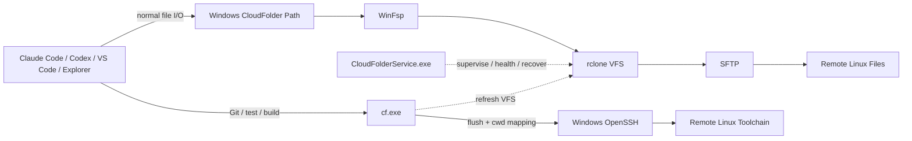

# CloudFolder

[](https://github.com/EurekaZang/CloudFolder/releases)
[](https://github.com/EurekaZang/CloudFolder/actions/workflows/ci.yml)
[](https://github.com/EurekaZang/CloudFolder/releases)
[](LICENSE)

**[中文](README.md) | [English](README.en.md) | [日本語](README.ja.md)**

> # サーバーをローカルにマウントする。Agent はローカルに残す。
>
> **Mount the server. Keep the Agent local.**

CloudFolder は、**AI Coding Agent + リモート Linux 開発**のための Windows Remote Workspace Layer です。

リモートの SSH/SFTP ディレクトリを通常の Windows パスとして公開し、Claude Code、Codex、VS Code、Explorer、その他のローカルアプリから直接読み書きできます。Git、テスト、ビルド、パッケージマネージャー、Linux ツールをサーバー側で実行すべきときは、`cf run` が現在のローカルディレクトリを対応する Linux cwd に自動マッピングし、実行前の書き戻しと実行後のキャッシュ更新まで調整します。

```text
Remote Linux: /home/alice/robotics
                    │
                    │ SFTP
                    ▼
Windows: C:\Users\Alice\CloudFolder\Lab\robotics
                    │
       ┌────────────┴────────────┐
       │                         │
       ▼                         ▼
Claude Code / Codex          cf run -- pytest -q
ローカルでファイル編集          同じ remote cwd で Linux 実行
```

**サーバー側に CloudFolder daemon をインストールする必要はありません。Claude Code / Codex を各サーバーへ再配置する必要もありません。** SSH/SFTP が使える Linux サーバーなら、既存の workspace をローカル開発環境に接続できます。

> 現在の初心者向け対象：**Windows 10/11 x64 + SSH/SFTP Linux Server**。

---

## 15 秒で理解する CloudFolder

従来のリモート開発では、たいてい次のどれかを選ぶ必要があります。

1. **Agent を各サーバーへインストールする** — Agent のログイン、権限、Skills、MCP、環境、バージョン設定をサーバーごとに繰り返す。
2. **SFTP/SSHFS だけをマウントする** — ファイルはローカルに見えるが、Git/build/test/package manager のような大量の小ファイルアクセスは遅くなりやすく、local cwd と remote cwd の統一された実行モデルがない。
3. **Remote-SSH IDE を使う** — IDE 内の体験は非常に良いが、workspace はその IDE の remote context であり、すべてのローカルアプリが使える普通の Windows path ではない。
4. **ファイルを同期する** — local copy と remote copy の 2 つが生まれ、同期方向、timestamp、conflict、source of truth を管理する必要がある。

CloudFolder は 5 つ目の方法を選びます。

> **ファイルシステムの入口はローカル Agent に残し、実行環境は Linux サーバーに残す。その 2 つを同じ workspace として扱う。**

これが CloudFolder の差別化です。

### Quick navigation

- **まず動きを見る：** [30 秒 Demo](#30-秒-demo)
- **SSHFS/rclone だけでは何が違う？：** [競合比較](#競合比較)
- **Install：** [Install](#install)
- **Agent と使う：** [Agent Integration](#agent-integration)
- **Command：** [`cf.exe` Command Reference](#cfexe-command-reference)
- **Trouble：** [Troubleshooting](#troubleshooting)

### 今の CloudFolder が向いている人

**特に向いている：** Windows がメイン desktop で、Claude Code/Codex/IDE は local、project・Linux toolchain・GPU・data は SSH server にある。

**不要な場合もある：** VS Code Remote-SSH の中だけで完結している、または必要なのが live remote filesystem ではなく完全な offline sync / mirror である。

---

# CloudFolder の本質は「mount」ではなく「consistency」

SFTP を Windows drive に見せること自体は、すでに多くの優れたツールが実現しています。

開発で難しいのは、次の連続性です。

```text
Agent がファイルを編集
    ↓
VFS はまだ非同期 write-back 中かもしれない
    ↓
remote pytest / git / cargo / cmake をすぐ実行
    ↓
remote command は直前の編集を必ず見る必要がある
    ↓
command は local cwd に対応する正確な Linux cwd で実行される必要がある
    ↓
remote で生成された artifact は local view に戻って見える必要がある
```

一般的な mount と `ssh host command` の組み合わせだけでは、この一連の保証は自動では得られません。

CloudFolder はそのために **Workspace Consistency Contract** を提供します。

1. **Mount resolution** — 現在の Windows path がどの CloudFolder mount に属するか特定する。
2. **cwd mapping** — local relative path を保存済みの absolute Linux root に決定的に対応付ける。
3. **Flush barrier** — remote 実行前に rclone VFS の queued / in-progress writes が 0 になるまで待つ。
4. **Strict SSH execution** — 専用 key、`known_hosts`、strict host verification を使う。
5. **Exit code preservation** — remote program の exit code をそのまま `cf run` の exit code にする。
6. **View refresh** — 実行後に VFS view を更新して、remote artifact を local から見えるようにする。

> **CloudFolder のコアは「SFTP を mount できること」ではなく、local filesystem plane と remote execution plane を 1 つの development workspace にすることです。**

---

# 30 秒 Demo

次を：

```text
alice@server.example.com:/home/alice/projects
```

Windows の：

```text
C:\Users\Alice\CloudFolder\Lab
```

へ mount したとします。

```powershell
# 普通の Windows path として remote project に入る
cd (cf path Lab)
cd robotics

# Agent 本体は Windows 上で動く
codex
# または: claude

# local cwd と remote cwd の対応を確認
cf here

# Git / test / build は remote Linux の対応 cwd で実行
cf run -- git status
cf run -- pytest -q
cf run -- cargo test

# && / pipe / redirect など shell syntax が必要な場合
cf sh -- "git status && pytest -q"

# 対応 remote cwd で interactive login shell
cf shell
```

現在の Windows cwd が：

```text
C:\Users\Alice\CloudFolder\Lab\robotics\src
```

mount の remote root が：

```text
/home/alice/projects
```

なら：

```powershell
cf run -- pwd
```

は remote の：

```text
/home/alice/projects/robotics/src
```

で実行されます。

**Windows path と remote shell path の mental mapping を自分で維持する必要がありません。**

---

# CloudFolder が埋める「欠けている 1 層」

リモート開発には、実際には 4 つの別問題があります。

## 1. Namespace：remote workspace を local namespace にする

ローカル Agent やアプリにとって最も普遍的なのは、次のような通常パスです。

```text
C:\Users\Alice\CloudFolder\Lab\repo\src\main.py
```

特定 IDE 内だけの remote object ではなく、Windows filesystem API を使うローカルソフトウェア全体が同じ workspace を見られます。

## 2. Execution locality：重い処理は server で実行する

remote project はしばしば次に依存します。

- Linux toolchain
- CUDA / GPU
- server 側の Python / Conda / uv
- Docker
- 大容量 RAM
- remote dataset
- 既存の build cache / dependency

そのため「local Agent にファイルを見せる」ことと「すべての command を Windows へ持ってくる」ことは同じではありません。

| 作業 | 推奨場所 |
|---|---|
| ピンポイントの read/edit | local CloudFolder path |
| create/rename/delete | local CloudFolder path |
| 小規模検索 | local / remote |
| Git | `cf run -- git ...` |
| pytest / cargo / cmake / npm / uv | `cf run -- ...` |
| repository-wide `rg` / `find` | `cf run -- rg ...` |
| server 環境依存 script | `cf run -- ...` |
| pipeline / redirect | `cf sh -- "..."` |

CloudFolder は **SFTP network semantics は local NVMe semantics ではない**ことを前提に設計されています。

## 3. Lifecycle：mount は terminal command ではなく infrastructure であるべき

理想は：

> 「昨日設定した mount が今日の reboot 後も存在し、network interruption から回復し、process crash のたびに command を打ち直さなくてよい。」

CloudFolder は Rust Windows Service で mount を監督します。

## 4. Agent awareness：いつ local、いつ remote かを Agent が理解する

```powershell
cf agent setup
```

CloudFolder は次のファイルの managed block のみを管理します。

```text
%USERPROFILE%\.claude\CLAUDE.md
%USERPROFILE%\.codex\AGENTS.md
```

既存の instruction は保持されます。

Agent に教えるルールは明快です。

> **編集は local filesystem。Git/build/test/大規模 scan は `cf run`。この workspace のためだけに remote で 2 つ目の coding agent を起動しない。**

---

# 競合比較

CloudFolder は SSH、SFTP、FUSE、remote development を発明したと主張しません。成熟した既存技術を積極的に利用しています。

違いは **product abstraction** です。

| 方式 | 最も得意なこと | ファイルの見え方 | command 実行 | Local Agent のモデル | 主なトレードオフ |
|---|---|---|---|---|---|
| **CloudFolder** | **Agent-native remote workspace** | 普通の Windows path | `cf run` が同じ remote cwd に自動 mapping | **Agent は local、file は local path、heavy work は remote** | 現在の簡易 UI は Windows + SFTP に集中 |
| [SSHFS-Win](https://github.com/winfsp/sshfs-win) | Windows SSHFS mount | Windows drive / UNC | SSH はユーザーが別途管理 | Agent は mount を読めるが execution plane は別 | 公式にも minimal SSHFS port。developer workflow orchestration は目的外 |
| [rclone mount + WinFsp](https://rclone.org/commands/rclone_mount/) | 汎用 remote/VFS mount engine | Windows filesystem | execution path は自分で設計 | file plane は作れるが cwd bridge / flush contract / service lifecycle / agent policy は別途必要 | 非常に強力な基盤コンポーネント |
| [RaiDrive](https://docs.raidrive.com/en/) / [ExpanDrive](https://docs.expandrive.com/integrations/sftp) / [Mountain Duck](https://docs.cyberduck.io/mountainduck/) | 洗練された cloud/SFTP desktop mount | Explorer / drive / integrated folder | mapped-cwd remote dev execution は中心 abstraction ではない | 一般ファイルアクセスに強い | CloudFolder はより狭く coding-agent + Linux toolchain に特化 |
| [VS Code Remote - SSH](https://code.visualstudio.com/docs/remote/ssh) | 完全な remote IDE | VS Code remote workspace | remote | VS Code 内では優秀 | remote に VS Code Server を install。system-wide Windows path ではなく VS Code remote context が中心 |
| [WinSCP Sync](https://winscp.net/eng/docs/task_synchronize) | transfer / directory sync | local copy + remote copy | ユーザーが選ぶ | Agent は local copy を操作可能 | 2 copy と sync semantics。live filesystem とは別モデル |

## SSHFS-Win vs CloudFolder

必要なのが：

> 「SFTP の drive letter が欲しい。」

だけなら SSHFS-Win はすでに非常に直接的な選択です。

CloudFolder が狙うのは：

> 「local Agent に remote Linux project を local workspace として見せつつ、Linux/Git/toolchain command は正しい remote cwd へ自動で戻し、mount 自体も長期運用したい。」

という workflow です。

## rclone + WinFsp vs CloudFolder

CloudFolder 自身が **rclone + WinFsp** を使っています。rclone の公式 `mount` documentation では、Windows の mount は foreground mode で動作し `--daemon` は無視されると明記されています。CloudFolder はその上で Windows Service hosting、supervision、recovery、mount lifecycle を product layer として提供します。

自分で次を管理したいなら、多くの能力を自作できます。

- rclone config
- WinFsp setup
- startup / Windows Service
- crash recovery / health probe
- RC endpoint / cache policy
- stale mount cleanup
- SSH key / `known_hosts`
- Windows ACL
- local cwd → remote cwd mapping
- VFS flush barrier
- exit-code propagation
- post-run refresh
- agent instructions

**CloudFolder の価値は、Linux server で開発する前に Windows filesystem integration engineer になる必要をなくすことです。**

## VS Code Remote-SSH vs CloudFolder

VS Code Remote-SSH は優れた remote IDE で、CloudFolder と排他的ではありません。

Remote-SSH の中心モデル：

```text
Local VS Code UI
      ↕
Remote VS Code Server + remote extensions + remote commands
```

CloudFolder の中心モデル：

```text
Any local App / Agent
      ↕ normal filesystem API
Windows CloudFolder path
      ↕
actual remote files

Local Agent
      ↕ cf run
actual remote Linux toolchain
```

VS Code だけで開発するなら Remote-SSH だけで十分な場合があります。

一方で **Codex、Claude Code、Explorer、他 IDE、script、desktop app が同じ普通の Windows workspace を共有し、Agent 本体は remote に移動させたくない**場合、CloudFolder の abstraction が直接的です。

## Sync tool vs CloudFolder

Sync：

```text
local copy  ⇄  remote copy
```

CloudFolder：

```text
local filesystem view  →  remote source of truth
```

その代わり、**CloudFolder は offline mirror ではなく live remote filesystem** です。

---

# WinFsp は競合ではなく、rclone も置き換え対象ではない

```text
CloudFolder product / workflow layer
              │
        ┌─────┴─────┐
        │           │
      rclone      WinFsp
        │           │
      SFTP      Windows FS bridge
```

- **WinFsp**：Windows userspace filesystem infrastructure
- **rclone**：remote storage / VFS mount engine
- **CloudFolder**：installation、configuration、security、lifecycle、recovery、developer CLI、agent guidance、file/execution consistency layer

CloudFolder は新しい SSH stack を再実装するのではなく、成熟した component を developer product にまとめます。

---

# どんな人に向いているか

## Local Claude Code / Codex + remote GPU server

Agent login、Skills、MCP、browser/GitHub context、desktop tools は local に維持し、CUDA、dataset、Docker、Linux dependency は server に維持する。

## 複数 Linux server を扱う開発者

```text
C:\Users\Alice\CloudFolder\
├── Lab-A
├── Lab-B
├── GPU-4090
├── GPU-H100
└── Aliyun
```

各 server を別々の Agent deployment project にするのではなく、workspace root にします。

## Research / Robotics / ML

日常 desktop は Windows、GPU compute / simulator / dataset / experiment は Linux、という構成に特に合います。

## Server を「developer desktop」にしたくないチーム

remote machine は：

```text
sshd + Linux toolchain + compute/data
```

のままでよく、CloudFolder daemon の remote install は不要です。

---

# Install

1. 最新 [GitHub Release](https://github.com/EurekaZang/CloudFolder/releases) から `CloudFolder-windows-x64.zip` を download。
2. 展開。
3. **`Install CloudFolder.cmd`** を double-click。

setup は 1 回 elevation を要求し、CloudFolder runtime、WinFsp、rclone を自動処理します。

必要なのは通常の SSH 情報だけです。

- friendly name：`Lab Server` など
- hostname / IP
- SSH port：default `22`
- username
- remote directory：blank なら SSH user home
- local Windows directory：default 提示あり

server が CloudFolder key をまだ trust していない場合：

1. Windows OpenSSH が host fingerprint を表示
2. host を確認
3. OpenSSH が SSH password を 1 回だけ入力要求
4. CloudFolder が public key を install
5. 以降の mount service は key authentication

**CloudFolder は SSH password を capture / 保存しません。**

server 側に CloudFolder binary は install されません。

### PowerShell bootstrap

```powershell
iwr https://raw.githubusercontent.com/EurekaZang/CloudFolder/main/install.ps1 -OutFile "$env:TEMP\install-cloudfolder.ps1"
powershell -ExecutionPolicy Bypass -File "$env:TEMP\install-cloudfolder.ps1"
```

bootstrap は latest Release と SHA-256 を取得・検証して同じ installer を起動します。

install 後：

```text
Start Menu → CloudFolder → CloudFolder Manager
```

または新しい terminal で `cf` を使えます。

---

# `cf.exe` Command Reference

```text
cf list
cf path <mount>
cf here
cf status [mount]
cf flush [mount]
cf refresh [mount]
cf run [mount] -- <program> [args...]
cf sh [mount] -- <shell command>
cf shell [mount]
cf agent setup|status|remove
```

### `cf list`
Configured mount を一覧表示。

### `cf path <mount>`
Windows path を返します。

```powershell
cd (cf path Lab)
```

### `cf here`
現在の mount、local root/cwd、remote cwd を表示。

### `cf status [mount]`
service state、mount state、pending writes、local root、remote root を表示。

### `cf flush [mount]`
VFS queued/in-progress writes が 0 になるまで待機。

### `cf refresh [mount]`
VFS directory view を invalidate / refresh。

### `cf run [mount] -- <program> [args...]`
Shell parsing が不要な program + argv 用。

```powershell
cf run -- git status
cf run -- pytest -q
cf run -- python scripts/train.py --config configs/a.yaml
```

```text
flush → map cwd → strict SSH → exec argv → preserve exit code → refresh
```

### `cf sh [mount] -- <shell command>`
`&&`、pipe、redirect、variable など shell syntax 用。

```powershell
cf sh -- "git status && pytest -q"
cf sh -- "rg TODO src | head -50"
```

### `cf shell [mount]`
Mapped remote cwd で interactive login shell を開きます。

mount 外から explicit に指定することもできます。

```powershell
cf run Lab -- git status
cf shell Lab
```

---

# Agent Integration

```powershell
cf agent setup
```

CloudFolder は managed block のみを：

```text
%USERPROFILE%\.claude\CLAUDE.md
%USERPROFILE%\.codex\AGENTS.md
```

へ追加します。

Agent には：

- normal local filesystem tool で edit
- `cf here` で CloudFolder workspace を判定
- Git/build/test/package manager/compiler/interpreter は `cf run`
- cold repository-wide scan は remote `rg` / `find` を優先
- shell syntax は `cf sh`
- この workspace のためだけに remote coding agent を追加起動しない

と案内します。

明示的 opt-in で、既存 instruction は保持されます。

```powershell
cf agent status
cf agent remove
```

---

# Architecture：3 planes, 1 workspace



```text
Data plane:       Windows path → WinFsp → rclone VFS → SFTP → remote files
Execution plane:  local cwd → cf.exe → SSH → matching Linux cwd
Control plane:    CloudFolderService → health / restart / backoff / cleanup
Agent plane:      Claude/Codex guidance → local I/O or remote execution
```

---

# Reliability Layer

現在の supervisor は次を含みます。

- mount ごとに独立 Windows Service
- child-process liveness check
- filesystem call が hang しても watchdog 自体を止めない独立 killable health probe
- abnormal exit 後の rclone 自動 replacement
- bounded exponential backoff + jitter
- Windows SCM recovery
- Windows **Job Object + `KILL_ON_JOB_CLOSE`** による orphan rclone 防止
- graceful rclone RC shutdown + PID verification
- stale reparse-point cleanup
- non-empty normal directory を mount path で隠す/上書きすることを拒否
- mount ごとの RC port / cache / logs
- bounded VFS cache
- minimum-free-space protection
- shared runtime upgrade 前後の safe stop / restore

> **Mount は誰かの terminal で動き続ける command ではなく、infrastructure として存在すべきです。**

---

# Default Dev Profile

- Local root：`%USERPROFILE%\CloudFolder\<name>`
- Dedicated key：`%USERPROFILE%\.ssh\cloudfolder_ed25519`
- Backend：SFTP
- VFS cache mode：`full`
- Cache max：`8 GiB`
- Minimum free space：`5 GiB`
- Developer write-back：`1s`
- `cf run`：explicit flush barrier
- Concurrent uploads：`8`
- Health probe：`10s` interval
- Probe timeout：`5s`
- 3 consecutive failure で recycle
- rclone idle SFTP connection：`20s`
- Windows Service：Automatic (Delayed)

Advanced user は：

```text
C:\ProgramData\CloudFolder\mounts\<name>\
```

の generated TOML / INI を編集できます。

---

# Security Model

## Host verification

public key authorization 前に Windows OpenSSH が server fingerprint を表示します。

その後は strict host checking と明示的な `known_hosts` metadata を使用します。`cf run` / `cf sh` / `cf shell` も同じ SSH identity 情報を使います。

## Password handling

SSH password は初回 key authorization 時に Windows OpenSSH が直接読む場合があります。CloudFolder は password を rclone config、TOML、log、environment variable、command line に保存しません。

## Unattended key trade-off

Windows Service は reboot ごとに private-key passphrase を interactive 入力できません。そのため CloudFolder はデフォルトで専用の**passphrase なし SSH private key**を作り、Windows ACL で保護します。

これは unattended reliability のための明示的な trade-off です。

## Windows filesystem ACL

mount service は LocalSystem として動きますが、CloudFolder は installing user SID を filesystem owner + FullControl にする per-user WinFsp `FileSecurity` を生成します。LocalSystem と Administrators も FullControl を保持し、Everyone FullControl は付与しません。

詳細は [SECURITY.md](SECURITY.md)。

---

# Performance：network filesystem を local NVMe のように見せかけない

CloudFolder は「すべての operation が local NTFS と同じ latency」とは約束しません。

SFTP round trip、server latency、directory size、file count、VFS cache state は性能に影響します。

特に Git は `.git` 内の metadata/object に多数の small random access を行うため、cold network mount では round trip が増幅されます。

CloudFolder の performance model：

```text
low fan-out / editing I/O  → local filesystem path
high fan-out / compute     → remote execution
```

だから `cf run` は補助的な SSH shortcut ではなく core feature です。

---

# CloudFolder Manager

意図的にシンプルです。

```text
1. Add a remote folder
2. Open a folder
3. Restart a mount
4. Remove a mount
5. Doctor / troubleshoot
6. Open logs
7. Exit
```

mount removal は local mount/service config を削除するだけで、**remote file は削除しません**。

VFS cache は通常 remove では保持されます。network failure 時、まだ server に届いていない write の最後の copy である可能性があるためです。明示的な `Uninstall -PurgeCache` で cache root を削除できます。

---

# Troubleshooting

```text
CloudFolder Manager → Doctor / troubleshoot
```

Doctor checks：

- CloudFolder service engine
- rclone
- WinFsp
- Windows OpenSSH
- configured Windows Services
- local mount points
- fresh strict SFTP connectivity

Logs：

```text
C:\ProgramData\CloudFolder\logs\
```

CLI：

```powershell
cf status
cf here
cf flush
cf refresh
```

---

# 現在の Limitations

CloudFolder は現在 intentionally narrow です。

- Beginner manager は現在主に **SFTP** を設定します。rclone の他 backend はまだ simple UI に全て公開していません。
- **Live remote filesystem** であり、offline sync mirror ではありません。
- network / server latency は残ります。
- mount 上での Git、package manager、cold repository-wide scan は遅い場合があるため `cf run` 推奨です。
- POSIX permission / ownership は Windows semantics に常に完全 mapping できるわけではありません。
- 現在の rclone SFTP projection は Linux symlink identity を native Windows symlink として完全保持しません。
- Release は現在 **Authenticode code-sign 未対応**で、Windows SmartScreen が unknown publisher を表示する場合があります。ZIP と同時に SHA-256 checksum を公開します。
- 現在の product focus は Windows local-agent → Linux SSH/SFTP workspace です。macOS/Linux client はこの release line の中心ではありません。

---

# FAQ

### Windows に repository 全体を同期しますか？

いいえ。Windows path は remote filesystem の live view です。rclone VFS cache は使用しますが、通常の full-project sync mirror ではありません。

### Server に root / CloudFolder daemon は必要ですか？

remote CloudFolder daemon は不要です。対象 directory にアクセスできる通常 SSH/SFTP account で構いません。

### なぜ mount 上で local `git status` を使わないのですか？

使うこと自体は可能ですが、Git の metadata-heavy access は cold network filesystem で遅くなる場合があります。

```powershell
cf run -- git status
```

を推奨します。

### 保存直後の file を `cf run` が見落としませんか？

remote execution 前に VFS queued/in-progress writes が drain するまで待ちます。これが Workspace Consistency Contract の一部です。

### Remote command が作った file が local で見えません

`cf run` は execution 後に VFS view を refresh します。手動でも：

```powershell
cf refresh
```

を使えます。

### AI Agent は必須ですか？

いいえ。CloudFolder は VS Code、Explorer、その他ローカルアプリ用の通常 remote-workspace layer としても使えます。

### 複数 server を mount できますか？

はい。各 mount に独立 service、config、cache、RC endpoint、logs があります。

### SSHFS-Win fork ですか？

違います。現在の filesystem engine は rclone SFTP + WinFsp です。CloudFolder はその上の product/workflow layer を実装します。

---

# For Developers

End user は Rust を install する必要がありません。

Windows build：

```powershell
.\scripts\build.ps1
```

CI：

```text
cargo fmt -- --check
cargo test
cargo clippy --all-targets -- -D warnings
PowerShell 5.1 parser checks
```

`v*` tag では test、`CloudFolderService.exe` / `cf.exe` build、3 言語 README package、ZIP + SHA-256 作成、GitHub Release publish を行います。

Validation：

```powershell
.\scripts\smoke-test.ps1 -MountPoint 'C:\Users\Alice\CloudFolder\Lab Server'

# destructive resilience test: elevated + disposable test mount only
.\scripts\fault-test.ps1 `
  -ServiceName 'CloudFolder.lab-server' `
  -MountPoint 'C:\Users\Alice\CloudFolder\Lab Server' `
  -RemoteHost 'server.example.com' `
  -RemotePort 22 `
  -RcPort 55770
```

---

# 一文で説明するなら

> **CloudFolder は server を local folder に変え、Agent を local に残し、command を server へ戻します。**

新しい Linux server を使うたびに：

```text
SSH
→ Agent を再 install
→ login を再設定
→ Skills/MCP を再設定
→ interactive environment を再構築
```

しているなら、その繰り返しをなくすのが CloudFolder の目的です。

**One local agent. Many remote workspaces.**

この workflow が役立つなら、Release を試し、Star を付け、実際の failure case を Issues に共有してください。CloudFolder では feature list より reliability を重視します。

---

# Credits

CloudFolder は以下の優れた project の上に構築されています。

- [rclone](https://rclone.org/) — remote storage / VFS mount engine
- [WinFsp](https://winfsp.dev/) — Windows userspace filesystem infrastructure
- [windows-service](https://crates.io/crates/windows-service) — Rust Windows Service integration

競合比較の公式 reference：

- [SSHFS-Win](https://github.com/winfsp/sshfs-win)
- [rclone mount](https://rclone.org/commands/rclone_mount/)
- [VS Code Remote - SSH](https://code.visualstudio.com/docs/remote/ssh)
- [WinSCP Synchronization](https://winscp.net/eng/docs/task_synchronize)
- [RaiDrive](https://docs.raidrive.com/en/)
- [ExpanDrive SFTP](https://docs.expandrive.com/integrations/sftp)
- [Mountain Duck](https://docs.cyberduck.io/mountainduck/)

## License

MIT. See [LICENSE](LICENSE).