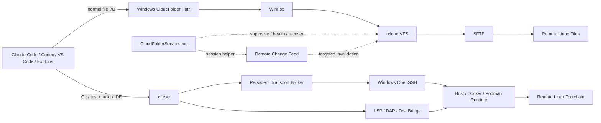

# CloudFolder

[](https://github.com/EurekaZang/CloudFolder/releases)
[](https://github.com/EurekaZang/CloudFolder/actions/workflows/ci.yml)
[](https://github.com/EurekaZang/CloudFolder/releases)
[](LICENSE)

**[中文](README.md) | [English](README.en.md) | [日本語](README.ja.md)**

> # 把服务器挂到本地，而不是把 Agent 部署到服务器。
>
> **Mount the server. Keep the Agent local.**

CloudFolder 是一个面向 **AI Coding Agent + 远端 Linux 开发** 的 Windows Remote Workspace Layer。

它把远端 SSH/SFTP 目录变成普通 Windows 路径，让 **Claude Code、Codex、VS Code、Explorer 以及任何本地程序**直接读写远端工作区；进入 `cf enter` 后，Git、Python、pytest、uv、cargo、编译器等 runtime 命令会透明路由到当前目录对应的远端 Linux cwd，而 `dir`、`explorer .`、`code .` 等本地工具继续留在 Windows。`cf run` / `cf sh` 仍保留给脚本和显式 remote exec。

```text
远端 Linux：/home/alice/robotics
                    │
                    │ SFTP
                    ▼
Windows：C:\Users\Alice\CloudFolder\Lab\robotics
                    │
       ┌────────────┴────────────┐
       │                         │
       ▼                         ▼
Claude Code / Codex          cf enter → pytest -q
本地读取、编辑文件              普通命令自动在远端同一 cwd 执行
```

**服务器端不需要安装 CloudFolder daemon，也不需要重新部署一套 Claude Code / Codex。** 只要服务器能正常 SSH/SFTP，CloudFolder 就能把它接进本地开发环境。

> 当前面向普通用户的一键安装目标：**Windows 10/11 x64 + SSH/SFTP Linux Server**。

---

## 15 秒理解 CloudFolder

传统远端开发通常迫使你在下面几种妥协中选一个：

1. **把 Agent 装到每台服务器**：每台机器都重新配置 Agent、登录、权限、Skills、MCP、环境和版本；
2. **只挂载 SFTP/SSHFS**：文件能在本地打开，但 Git / build / test / package manager 这类大量小文件操作直接跑在挂载盘上会很慢，而且本地 cwd 与远端 cwd 没有统一语义；
3. **用 Remote-SSH IDE**：远端开发体验很好，但工作区属于特定 IDE 的 remote context，本地独立 Agent 和其他 Windows 工具并没有得到一个普通系统路径；
4. **用同步工具复制项目**：本地和远端出现两份状态，需要考虑同步方向、时间戳、冲突和“到底哪份才是真的”。

CloudFolder 选择第五种方式：

> **文件系统留给本地 Agent，执行环境留给远端 Linux。CloudFolder 保证两者指向同一个 workspace。**

这就是项目的核心差异化。

### 快速导航

- **想先看效果：** [30 秒 Demo](#30-秒-demo)
- **想知道为什么不能直接用 SSHFS/rclone：** [竞品比较](#竞品比较)
- **准备安装：** [安装](#安装)
- **准备给 Agent 用：** [Agent 集成](#agent-集成)
- **查命令：** [`cf.exe` 命令参考](#cfexe-命令参考)
- **出问题了：** [Troubleshooting](#troubleshooting)

### 你是否适合现在就用？

**很适合：** Windows 是你的主桌面，本地跑 Claude Code/Codex/IDE，项目与 Linux toolchain/GPU/data 在 SSH Server。

**可能不需要：** 你只在 VS Code Remote-SSH 内开发；或者你真正需要的是完整 offline sync / 双向镜像，而不是 live remote filesystem。

---

# CloudFolder 真正解决的不是“挂载”，而是“一致性”

把 SFTP 显示成 Windows 盘符或目录，已经有很多优秀工具可以做到。

远端开发真正麻烦的是下面这个时序：

```text
Agent 修改文件
    ↓
VFS 可能仍在异步写回
    ↓
马上运行远端 pytest / git / cargo / cmake
    ↓
远端命令必须看到刚才那次修改
    ↓
命令还必须运行在“当前本地子目录”对应的准确 Linux cwd
    ↓
命令生成的新文件又必须及时出现在本地视图
```

一个普通 mount + 一个普通 `ssh host command` 并不能天然保证这条链路。

CloudFolder 为此提供一个 **Workspace Consistency Contract（工作区一致性契约）**：

1. **确定挂载身份**：知道当前 Windows 路径属于哪一个 CloudFolder mount；
2. **确定 cwd 映射**：把本地相对目录确定性映射到该 mount 保存的绝对 Linux root；
3. **Flush Barrier**：远端执行前等待 rclone VFS 的 queued / in-progress writes 清零；
4. **Strict SSH Execution**：使用固定 key、`known_hosts` 和严格 host verification 执行；
5. **Exit Code Preservation**：routed command 与显式 `cf run` 都保留远端程序 exit code；
6. **View Refresh**：执行完成后刷新 VFS 目录视图，让远端生成的 artifacts 回到本地可见状态。
7. **Remote Change Feed**：与前台 command 无关的 remote create/modify/rename/delete 也会触发 targeted VFS invalidation，让一致性从 command-bound 扩展到 workspace-wide。

因此：

> **CloudFolder 的核心不是“我也能 mount SFTP”。CloudFolder 的核心是让 local filesystem plane 与 remote execution plane 成为同一个开发工作区。**

---

# 30 秒 Demo

假设服务器上有：

```text
alice@server.example.com:/home/alice/projects
```

CloudFolder 把它挂到：

```text
C:\Users\Alice\CloudFolder\Lab
```

然后：

```powershell
# 进入远端项目，但 Windows/Agent 看见的是普通本地路径
cd (cf path Lab)
cd robotics

# Agent 本体仍然运行在你的 Windows 电脑
codex
# 或
claude

# 进入 CloudFolder Remote Runtime
cf enter

# 现在这些都是普通命令，但执行发生在远端 Linux 的对应 cwd
git status
pytest -q
cargo test

# explorer / code 仍然是本地 Windows 工具
explorer .
code .

# 脚本或 shell syntax 仍可显式使用 legacy API
cf run -- git status
cf sh -- "git status && pytest -q"
```

如果你当前位于：

```text
C:\Users\Alice\CloudFolder\Lab\robotics\src
```

而这个 mount 的远端 root 是：

```text
/home/alice/projects
```

在 `cf enter` 里运行：

```powershell
pwd
```

会在远端对应的：

```text
/home/alice/projects/robotics/src
```

中执行。

**你不再需要在“本地文件路径”和“远端 shell 路径”之间自己做 mental mapping。**

---

# v0.9：Workspace-wide Consistency / Persistent Transport / IDE + Container Runtime

v0.7 建立了 **Local Workspace / Remote Runtime**。v0.9 把这个抽象从“command-bound”推进到整个 workspace：远端自己写文件、本地连续执行命令、交互式 terminal、IDE language service/debugger，以及 Docker/Podman runtime 都使用同一套 cwd、environment、consistency 和 path mapping。

## 1. Remote Change Feed —— 不再靠 `cf run` 才刷新

每个 mount service 会通过一条 session-scoped SSH connection 在 Linux 端启动无 root 的 Python/inotify helper。它不会安装永久 daemon，也不会每秒扫描整棵目录树；文件事件会被合并为 targeted rclone VFS invalidation。

真实独立 SSH Gate（**0 次 `cf run` / `cf refresh`**）：create 1.379s、modify 1.413s、rename 1.716s、delete 0.863s；后台 job 的一次真实写入从 remote timestamp 到 Windows 可见约 433ms。

watcher 会读取 Linux inotify limit，只使用受控预算、为动态目录保留容量，并优先发现 project root；>512 个 burst event 会按受影响目录合并。10 万文件 Gate 中 change-feed connection/ready count 保持不变，证明没有周期性 full-tree re-scan。

> **极端边界：**单个目录直接包含 100,000 个文件时，rclone/SFTP 的首次目录枚举仍可能很慢；实机读取最后一个 cold entry 约 96.7s。这个边界来自巨型单目录 projection，而不是 watcher 回退到轮询扫描。正常 project directory 的独立 remote change Gate 仍为 ≤2s。

## 2. Persistent SSH Transport —— routed command 不再每次重新认证

```powershell
cf transport status
cf transport bench GPU-Server 100
cf transport restart
```

CloudFolder 为每个 mount 维护 loopback-only Transport Broker 和一条长寿命 SSH transport。每个 request 仍在远端独立 `/bin/sh` 中执行，避免 cwd/environment 污染；broker 不可用时自动回退 fresh SSH。PTY、detached job launch 等需要独立 terminal/lifecycle semantics 的路径不会为了复用连接而牺牲正确性。

真实 6000 端 1000-command Gate：fresh SSH 502.9ms，warm P50 46.8ms，P95 50.1ms，约 **10.7×** startup speedup。安装升级会先只关闭 CloudFolder 自己的 broker，避免 `cf.exe` 自锁；下一条 routed command 自动 lazy restart。

## 3. PTY-aware Terminal Runtime —— Python / GDB / top 真正可交互

`cf enter` 会根据 stdin/stdout terminal state 与命令语义自动决定 PTY。裸 `python` / `node` / `gdb` / `top` / `less` / interactive shell 获得真实 TTY；pipeline、Agent automation 与重定向保持无 PTY。

```powershell
cf run --pty -- python
cf run --no-pty -- pytest -q
```

实机 Gate 已验证 Python REPL、`Ctrl+C → KeyboardInterrupt`、Node REPL、GDB `break main → run → Breakpoint 1`、全屏 `top`；`--no-pty` 下 stdin/stdout/stderr `isatty()` 全部为 false，pipeline 输出不被 ANSI/CRLF 语义污染。

## 4. Container-aware Runtime —— local cwd 映射到真正 runtime，而不只 SSH host

```toml
[runtime]
type = "docker"        # host / docker / podman
container = "isaaclab"
runtime_root = "/workspace"
```

`.cloudfolder.toml` 所在目录默认就是 host project root，也可显式配置 `host_root`。routed command、environment、PTY、persistent job、forward、LSP/DAP/debugger/test discovery 全部共享同一套：

```text
Windows cwd → remote host cwd → container runtime cwd
```

真实 Gate 中 host 无 `cf_runtime_only`，container-only module 的 `VALUE=4242` 被 routed Python 正确读取，cwd 为 `/workspace`；container job 的 durable metadata 留在 host，`cf job stop` 后 container 内没有 `CLOUDFOLDER_JOB_ID` orphan。

Container forwarding 不依赖 Docker bridge IP：CloudFolder 会在 remote host loopback 启动 session-scoped runtime relay，再通过 `docker/podman exec -i` 桥到 container loopback。即使实测 host→Docker bridge HTTP 不可用，本地 `cf forward` 仍返回 HTTP 200；stop 时 SSH tunnel 与 relay 一起清理。

## 5. Remote IDE Bridge —— local IDE UI，不安装 VS Code Server

```powershell
cf lsp python
cf lsp clangd
cf lsp rust
cf debug python -- main.py
cf source read /usr/local/lib/python3.11/site-packages/pkg.py
cf test discover --framework pytest
```

底层是 editor-agnostic Content-Length JSON bridge：Windows `file://` / path 会映射到 remote host/container，diagnostics、definition、DAP source/stack 再映回 Windows。workspace 外部源码不会伪造 `C:\usr\...`，而是使用只读 `cloudfolder-runtime://<mount>/...`；`cf source read` 从真实 runtime 读取内容。

真实 Formal Gates：

- **Pyright：**container-only module 产生真实 diagnostics，completion 包含 `VALUE`，Go to Definition 跳到 `cloudfolder-runtime://.../site-packages/cf_runtime_only.py`；
- **debugpy：**breakpoint verified，真实停在 Windows `debug_target.py:4`，stack path 映回 Windows，continue 后 container-only dependency 输出 `before 4242 / after 4243`；
- **pytest：**`cf test discover` 1.22s 发现 container-only test，`cf test run` 549ms 完成 `1 passed`；
- **clangd + CUDA：**clangd 19 使用 remote `/workspace/compile_commands.json`，真实 CUDA 13 header 与 host SHA256 完全一致；`cudaError_t` definition 跳到真实 `driver_types.h` 并映射为 `cloudfolder-runtime://...`。

仓库与 Release 同时提供 [`editors/vscode`](editors/vscode) reference extension / `CloudFolder-vscode.vsix`：它只负责把 VS Code LanguageClient、Testing、Python Debugger 和 `cloudfolder-runtime://` provider 接到上述 `cf` API，**远端不安装 VS Code Server**。

---

# v0.7：Local Workspace / Remote Runtime

v0.7 把 CloudFolder 从“稳定挂载 + `cf run`”推进成完整的 **Local Workspace / Remote Runtime abstraction**。

## 1. Execution Router —— 进入后忘掉 `cf run`

```powershell
cd (cf path Lab)
cf enter

git status
python train.py
pytest -q
uv sync
```

`cf enter` 会把一组明确的 remote runtime tool shim 放到当前 session 的 PATH 前面。Git、Python、pytest、uv、pip、conda、cargo、cmake、node、npm、rg、find、bash、nvidia-smi 等会自动经过 CloudFolder 的 flush barrier、cwd mapping、SSH execution 和 VFS refresh；`cd`、`dir`、`explorer`、`code` 仍走本地。

**Formal Gate：**真实远端 workspace 已完成 `git → 本地 edit → test → add → commit`，全程只使用普通 `git` / `python` 命令，**0 次主动 `cf run`**。

## 2. Workspace Environment —— Conda / module / CUDA 配一次

在 workspace 根目录放置 `.cloudfolder.toml`：

```toml
[environment]
shell = "bash -lc"
init = """
source ~/.bashrc
"""

[environment.profiles.isaaclab]
init = """
conda activate isaaclab
module load cuda/12.4
export CUDA_VISIBLE_DEVICES=1
"""
```

然后：

```powershell
cf env
cf env use isaaclab
cf env reload
```

基础 `init` 与当前 profile 会自动应用到 routed command、显式 `cf run` / `cf sh`、`cf shell` 和 persistent job。`cf env use` 只保存本机选择，不会重写已提交的 `.cloudfolder.toml`。模板见 [`config/workspace.toml.example`](config/workspace.toml.example)。

## 3. Persistent Jobs —— 电脑断线，远端任务继续

```powershell
cf job run -- python train.py
cf job list
cf job logs cf-a83f
cf job logs -f cf-a83f
cf job attach cf-a83f
cf job stop cf-a83f
```

第一版使用远端 `setsid + nohup` 与 `~/.cloudfolder/jobs/` 元数据。启动后本地 SSH / CloudFolder / 电脑退出都不会结束任务，重新连接后仍能恢复状态和日志。`attach` 当前是对 durable live log 的重新附着，不是通用 interactive stdin 恢复；Slurm/PBS 资源调度仍交给 scheduler。

## 4. Port Forwarding —— Jupyter / TensorBoard 不再手写 `ssh -L`

```powershell
cf forward 8888
cf forward 6006
cf forward list
cf forward stop 8888
cf forward stop all
```

如果本机同端口已占用，CloudFolder 会自动选择可用 local port，并打印可直接打开的 `http://127.0.0.1:<port>/`。当前是显式 forwarding；还没有通过任意应用 stdout 自动猜端口。

## 5. SSH Config / ProxyJump —— `ssh <host>` 能连，CloudFolder 就接管

已有：

```sshconfig
Host h100
    HostName 10.0.0.23
    User zang
    IdentityFile ~/.ssh/id_ed25519
    ProxyJump gateway
```

直接：

```powershell
cf add h100
```

CloudFolder 会复用 Windows OpenSSH 解析后的 Host、User、Port、IdentityFile、CertificateFile、known_hosts、ProxyJump / ProxyCommand 等信息。后台 LocalSystem mount 不会直接读取用户私钥；安装时会为该 mount 生成 **SYSTEM-safe SSH snapshot**，只复制实际需要的 SSH material，并用 SYSTEM / Administrators ACL 封闭。

**Formal Gate：**已用真实 `22 → ProxyJump → 6000` 链路验证：`ssh <alias>` 成功后，`cf add <alias>` 能由 LocalSystem 创建 `Running / Mounted / PendingWrites=0` 的 SFTP mount。

---

# 为什么“没有 CloudFolder”会缺一层？

因为远端开发其实有四个不同问题，而传统工具通常只解决其中一部分。

## 1. Namespace：让远端目录成为本地命名空间

Agent、IDE、Explorer 和本地脚本最好看到的是：

```text
C:\Users\Alice\CloudFolder\Lab\repo\src\main.py
```

而不是某个工具内部的“remote workspace object”。

系统级路径意味着本地所有遵守 Windows 文件 API 的程序都能接入，而不是只支持某一个 IDE。

## 2. Execution locality：重活应该在服务器上跑

远端项目通常依赖：

- Linux toolchain；
- CUDA / GPU；
- 服务器上的 Python / Conda / uv 环境；
- Docker；
- 大内存；
- 本地没有的数据集；
- 服务器已有的编译缓存与依赖。

因此“让 Agent 读文件”不等于“把所有命令都搬回 Windows”。

CloudFolder 明确把两件事分开：

| 工作 | 推荐位置 |
|---|---|
| 精确读取/修改几个文件 | 本地 CloudFolder 路径 |
| 新建、重命名、删除文件 | 本地 CloudFolder 路径 |
| 小范围代码搜索 | 本地或远端均可 |
| Git | `cf run -- git ...` |
| pytest / cargo / cmake / npm / uv | `cf run -- ...` |
| repository-wide `rg` / `find` | `cf run -- rg ...` |
| 依赖服务器环境的脚本 | `cf run -- ...` |
| 复杂 shell pipeline | `cf sh -- "..."` |

这不是绕开文件系统，而是承认 **SFTP 的网络语义与本地 NVMe 不同**，并把远端执行做成一等公民。

## 3. Lifecycle：一个 mount 必须像基础设施，而不是一个终端进程

开发者真正需要的是：

> “昨天配置过，今天开机还能用；网络断一下能恢复；进程崩了不用我重新敲命令。”

CloudFolder 用 Rust Windows Service 管理 mount 生命周期，而不是要求用户永久留一个 `rclone mount` 终端窗口。

## 4. Agent awareness：Agent 必须知道什么时候该本地、什么时候该远端

CloudFolder 可选地给 Claude Code 和 Codex 安装条件化指导：

```powershell
cf agent setup
```

它只维护 CloudFolder 自己的 managed block：

```text
%USERPROFILE%\.claude\CLAUDE.md
%USERPROFILE%\.codex\AGENTS.md
```

现有用户指令会被保留。

Agent 因此可以形成一个稳定规则：

> **文件编辑走本地 filesystem；Git/build/test/大范围扫描走 `cf run`；Agent 本身不需要在服务器上再启动一份。**

---

# 竞品比较

CloudFolder 不声称发明了 SSH、SFTP、FUSE 或 remote development。相反，它大量建立在成熟基础设施上。

差异在于**产品抽象**。

| 方案 | 它最擅长解决什么 | 文件在哪里呈现 | 命令在哪里执行 | 对本地 AI Agent 的核心体验 | 主要取舍 |
|---|---|---|---|---|---|
| **CloudFolder** | **Agent-native remote workspace** | 普通 Windows 路径 | `cf run` 自动映射到远端同 cwd | **Agent 留本地；文件本地可见；重活远端执行** | 当前简单安装器主要聚焦 Windows + SFTP |
| [SSHFS-Win](https://github.com/winfsp/sshfs-win) | Windows 上的 SSHFS mount | Windows drive / UNC | 用户另行 SSH | Agent 可以读挂载盘，但 execution plane 需要自己组织 | 官方定位就是 minimal SSHFS port；开发工作流编排不是其目标 |
| [rclone mount + WinFsp](https://rclone.org/commands/rclone_mount/) | 通用 remote/VFS mount engine | Windows filesystem | 用户自己组织 | 能搭出类似 file plane，但 cwd bridge、flush contract、service lifecycle 需要自己组合 | 极强、极灵活，也因此更偏基础组件 |
| [RaiDrive](https://docs.raidrive.com/en/) / [ExpanDrive](https://docs.expandrive.com/integrations/sftp) / [Mountain Duck](https://docs.cyberduck.io/mountainduck/) | 成熟的云盘/SFTP 桌面挂载体验 | Explorer / drive / integrated folder | 不以“映射 cwd 后远端执行开发命令”为核心抽象 | 很适合通用文件访问 | CloudFolder 更窄，但专门针对 coding-agent + Linux toolchain 的闭环 |
| [VS Code Remote - SSH](https://code.visualstudio.com/docs/remote/ssh) | 完整远端 IDE 开发 | VS Code remote workspace | 远端 | VS Code 内体验优秀 | 会在远端安装 VS Code Server；工作区主要属于 VS Code remote context，而非系统级普通 Windows 路径 |
| [WinSCP Sync](https://winscp.net/eng/docs/task_synchronize) | 文件传输与目录同步 | 一份本地副本 + 一份远端副本 | 用户自行 SSH / 本地执行 | Agent 可以操作本地副本 | 双副本、同步方向、时间戳与冲突语义不同于 live filesystem |

## SSHFS-Win vs CloudFolder

如果你的目标只是：

> “给我一个 SFTP 盘符。”

SSHFS-Win 已经非常直接，而且成熟。

CloudFolder 的目标更具体：

> “我要让本机 Agent 把远端 Linux 项目当本地 workspace，同时又让所有 Linux/Git/toolchain 命令天然回到服务器正确 cwd 执行，并且 mount 长期自愈。”

所以 CloudFolder 不是为了替换 SSHFS-Win 的每一个用例，而是为了覆盖 **remote development / local agent** 这个更高层的 workflow。

## rclone + WinFsp vs CloudFolder

CloudFolder 本身就使用 **rclone + WinFsp**。rclone 官方 `mount` 文档同时明确说明：在 Windows 上 mount 以前台模式运行，`--daemon` 会被忽略。CloudFolder 因此把 Windows Service、supervision、recovery 与 mount lifecycle 作为产品层的一部分，而不是要求用户自己再找一个进程托管方案。

如果你愿意自己维护：

- rclone 配置；
- WinFsp 安装；
- mount startup；
- Windows Service；
- crash recovery；
- health probe；
- RC port；
- cache policy；
- stale mount cleanup；
- SSH key / known_hosts；
- ACL；
- local cwd → remote cwd；
- VFS write flush barrier；
- remote exit code；
- execution 后 cache refresh；
- Agent instructions；

那么你当然可以自己搭出很多 CloudFolder 能力。

**CloudFolder 的价值正是：你不应该为了“在服务器上写代码”先成为 Windows filesystem integration engineer。**

## VS Code Remote-SSH vs CloudFolder

VS Code Remote-SSH 是优秀的 remote IDE 方案，而且它和 CloudFolder 并不互斥。

它的核心模型是：

```text
本地 VS Code UI
      ↕
远端 VS Code Server + remote extensions + remote commands
```

CloudFolder 的核心模型是：

```text
本地任何 App / Agent
      ↕ normal filesystem API
Windows CloudFolder path
      ↕
远端真实 files

本地 Agent
      ↕ cf run
远端真实 toolchain
```

如果你只在 VS Code 里开发，Remote-SSH 可能已经足够。

如果你希望 **Codex、Claude Code、Explorer、其他 IDE、脚本、桌面工具共享同一个普通 Windows workspace，而不把 Agent 本体搬到服务器**，CloudFolder 的抽象更直接。

## 同步工具 vs CloudFolder

同步工具的模型是：

```text
local copy  ⇄  remote copy
```

CloudFolder 的模型是：

```text
local filesystem view  →  remote source of truth
```

这意味着 CloudFolder 不需要定义“哪边更新覆盖哪边”的常规同步工作流。

代价也很明确：**CloudFolder 是 live remote filesystem，不是 offline mirror。网络断开时它不会神奇地变成本地完整仓库。**

---

# WinFsp 不是竞品，rclone 也不是“被替代对象”

CloudFolder 的技术栈是：

```text
CloudFolder product / workflow layer
              │
        ┌─────┴─────┐
        │           │
      rclone      WinFsp
        │           │
      SFTP      Windows FS bridge
```

- **WinFsp**：Windows 用户态文件系统基础设施；
- **rclone**：remote storage / VFS mount engine；
- **CloudFolder**：安装、配置、安全、生命周期、自愈、开发者 CLI、Agent workflow 和 file/execution consistency layer。

CloudFolder 的方向不是重新造一个 SSH 协议栈，而是把成熟组件组合成一个**普通开发者愿意长期使用的产品**。

---

# 谁最需要 CloudFolder？

## 1. 本地 Claude Code / Codex + 云端 GPU Server

你希望 Agent 使用本机已经配置好的：

- 登录；
- Skills；
- MCP；
- GitHub/浏览器环境；
- 本机桌面工具；

但代码、数据、CUDA、Docker 和依赖都在 GPU Server。

CloudFolder 让 Agent 不必被重新部署。

## 2. 一个人维护很多 Linux Server

```text
C:\Users\Alice\CloudFolder\
├── Lab-A
├── Lab-B
├── GPU-4090
├── GPU-H100
└── Aliyun
```

不同服务器第一次配置后，长期以普通路径存在。

对 Agent 来说，它们不是五套“远端连接插件”，而是五个 workspace root。

## 3. 科研 / Robotics / ML

常见现实是：

- Windows 是日常桌面；
- GPU / simulator / dataset 在 Linux；
- 论文、浏览器、Office、即时通信和本地 Agent 都在 Windows；
- 真正实验环境必须留在服务器。

CloudFolder 适合这种**本地交互 + 远端算力**分工。

## 4. 不想让每台服务器都变成“开发桌面”的团队

远端机器只需要继续做它本来擅长的事：

```text
sshd + Linux toolchain + compute/data
```

不必为了每个开发者、每个 Agent 再铺一套完整交互环境。

---

# 安装

1. 打开最新 [GitHub Release](https://github.com/EurekaZang/CloudFolder/releases)，下载 `CloudFolder-windows-x64.zip`；
2. 解压；
3. 双击 **`Install CloudFolder.cmd`**。

安装器会请求一次管理员权限，并自动处理 CloudFolder runtime、WinFsp 和 rclone。

随后只需要填写普通 SSH 用户本来就知道的信息：

- 名称，例如 `Lab Server`；
- IP / hostname；
- SSH port，默认 `22`；
- SSH username；
- remote directory，留空表示 SSH 用户 home；
- local Windows folder，安装器提供默认值。

如果服务器还没有信任 CloudFolder 专用 key：

1. Windows OpenSSH 先显示服务器 fingerprint；
2. 你确认 host；
3. OpenSSH 询问一次 SSH password；
4. CloudFolder 安装 public key；
5. 后续 mount service 只使用 key authentication。

**CloudFolder 不捕获、不保存 SSH password。**

服务器端不需要安装 CloudFolder binary。

### PowerShell Bootstrap

不想手动下载 ZIP：

```powershell
iwr https://raw.githubusercontent.com/EurekaZang/CloudFolder/main/install.ps1 -OutFile "$env:TEMP\install-cloudfolder.ps1"
powershell -ExecutionPolicy Bypass -File "$env:TEMP\install-cloudfolder.ps1"
```

Bootstrap 会：

1. 读取最新 GitHub Release；
2. 下载 `CloudFolder-windows-x64.zip`；
3. 下载对应 SHA-256；
4. 校验包；
5. 启动同一套 elevated installer。

安装完成后可从：

```text
Start Menu → CloudFolder → CloudFolder Manager
```

管理 mount，新终端中也可以直接使用 `cf`。

---

# cf.exe 命令参考

```text
cf list
cf path <mount>
cf here
cf status [mount]
cf enter [mount]
cf env [use <profile>|reload]
cf runtime [check]
cf transport status|stop|restart|bench [mount]
cf lsp [--mount <mount>] python|clangd|rust|-- <server> [args...]
cf debug dap [--mount <mount>] -- <adapter> [args...]
cf debug python [--mount <mount>] [--local-port <port>] -- <program> [args...]
cf source read [--mount <mount>] <absolute-runtime-path>
cf test discover [--mount <mount>] [--framework pytest]
cf test run [--mount <mount>] <pytest-nodeid>
cf job run [mount] -- <program> [args...]
cf job list [mount]
cf job logs [-f] <job> [--mount <mount>]
cf job attach <job> [--mount <mount>]
cf job stop <job> [--mount <mount>]
cf forward <remote-port> [local-port] [--mount <mount>]
cf forward list [mount]
cf forward stop <local-port|all> [--mount <mount>]
cf add <ssh-config-host>
cf flush [mount]
cf refresh [mount]
cf run [--pty|--no-pty] [mount] -- <program> [args...]
cf sh [mount] -- <shell command>
cf shell [mount]
cf agent setup|status|remove
```

## `cf list`

列出所有 mount：

```powershell
cf list
```

## `cf path`

返回 mount 的 Windows path，非常适合 PowerShell：

```powershell
cd (cf path Lab)
```

## `cf here`

从当前 cwd 解析：

- mount；
- profile；
- local root；
- local cwd；
- remote cwd。

```powershell
cf here
```

## `cf status`

查看 Windows Service、mount 是否存在、pending writes、local root、remote root：

```powershell
cf status
cf status Lab
```

## `cf enter`

进入透明 Remote Runtime session：

```powershell
cf enter Lab
git status
pytest -q
```

从 mount 内执行 `cf enter` 时 mount 名可以省略。这个 session 中 remote runtime tool 自动路由，Windows 本地工具保持本地。

## `cf env`

查看或选择 `.cloudfolder.toml` 环境 profile：

```powershell
cf env
cf env use isaaclab
cf env reload
```

## `cf job`

持久远端任务：

```powershell
cf job run -- python train.py
cf job list
cf job logs -f <job>
cf job attach <job>
cf job stop <job>
```

## `cf forward`

建立与管理 SSH local forwarding：

```powershell
cf forward 8888
cf forward 6006 16006
cf forward list
cf forward stop 8888
cf forward stop all
```

## `cf add <ssh-config-host>`

直接采用现有 OpenSSH config host，包括 ProxyJump / ProxyCommand 等 OpenSSH 行为：

```powershell
cf add h100
```

## `cf flush`

等待当前 VFS pending upload 清零：

```powershell
cf flush
```

## `cf refresh`

主动 forget / refresh VFS directory cache：

```powershell
cf refresh
```

## `cf run`

兼容保留的显式 remote-exec API，用于脚本、CI、未列入 Router 的第三方 CLI，或你明确希望绕过透明路由时。普通交互式开发优先 `cf enter`。

```powershell
cf run -- git status
cf run -- pytest -q
cf run -- python scripts/train.py --config configs/a.yaml
```

它会：

```text
flush → map cwd → strict SSH → exec argv → preserve exit code → refresh
```

## `cf sh`

当你需要 `&&`、pipe、redirect、变量等 shell 语义：

```powershell
cf sh -- "git status && pytest -q"
cf sh -- "rg TODO src | head -50"
```

## `cf shell`

打开交互式远端 login shell，并自动进入映射后的 remote cwd：

```powershell
cf shell
```

## 显式指定 mount

不在 mount 目录中时可以直接指定：

```powershell
cf run Lab -- git status
cf shell Lab
```

---

# Agent 集成

```powershell
cf agent setup
```

CloudFolder 会维护：

```text
%USERPROFILE%\.claude\CLAUDE.md
%USERPROFILE%\.codex\AGENTS.md
```

中的 CloudFolder managed block。

v0.9 的 managed block 会优先建议从 `cf enter` 启动 Agent/terminal；在该 session 中直接使用普通 Git / Python / build / test 命令。`cf run` / `cf sh` 只保留给显式 remote exec、Router 未覆盖的 CLI 与 shell syntax。

这段规则会告诉 Agent：

- 普通文件读写直接使用本地路径；
- `cf here` 判断是否处于 CloudFolder workspace；
- `cf enter` 内 Git/build/test/package manager/compiler/interpreter 直接使用普通命令；
- repository-wide scan 优先 routed `rg` / `find`；
- pipeline / redirect 使用 `cf sh`；
- 不要为了这个 workspace 再在远端启动第二个 coding agent。

这个集成是**显式 opt-in**，普通 CloudFolder 安装不会偷偷修改 Agent 配置。

```powershell
cf agent status
cf agent remove
```

原有用户 instructions 会保留。

---

# Architecture：三个平面，一个 workspace



换成一句话：

```text
Data plane:       Windows path → WinFsp → rclone VFS → SFTP → remote files
Execution plane:  local cwd → cf.exe → warm/fresh SSH → host/container runtime cwd
IDE plane:        VS Code/editor → cf LSP/DAP/test bridge → same remote runtime
Control plane:    CloudFolderService → health / restart / change feed / cleanup
Agent plane:      Claude/Codex instructions → local file I/O + transparent remote runtime
```

---

# 为什么 mount 能长期活着？

`rclone mount` 本身是优秀的 mount engine，但 CloudFolder 把“如何让它成为 Windows 基础设施”做成产品的一部分。

当前 supervisor 包含：

- **每个 mount 一个 Windows Service**，故障隔离；
- child-process liveness 检查；
- 独立、可超时终止的 filesystem health probe，避免 watchdog 自己被卡死；
- rclone 异常退出后自动 replacement；
- bounded exponential backoff + jitter；
- Windows SCM recovery；
- Windows **Job Object + `KILL_ON_JOB_CLOSE`**，避免孤儿 rclone；
- graceful rclone RC shutdown + PID verification；
- stale reparse-point cleanup；
- 如果 mount path 是非空普通目录，**拒绝隐藏/覆盖它**；
- 每个 mount 独立 RC port；
- 每个 mount 独立 cache；
- 每个 mount 独立 logs；
- VFS cache size bound；
- minimum-free-space protection；
- shared runtime upgrade 前安全 stop / upgrade / restore mount services。

目标很简单：

> **Mount 应该是“存在”，不是“正在某个终端窗口里运行”。**

---

# 默认 Dev Profile

普通用户的新 mount 默认面向开发场景：

- Local root：`%USERPROFILE%\CloudFolder\<name>`
- Dedicated key：`%USERPROFILE%\.ssh\cloudfolder_ed25519`
- Backend：SFTP
- VFS cache mode：`full`
- Cache max size：`8 GiB`
- Minimum free space：`5 GiB`
- Developer write-back：`1s`
- `cf run`：仍执行显式 flush barrier
- Concurrent VFS uploads：`8`
- Health probe：每 `10s`
- Probe timeout：`5s`
- 连续失败 3 次触发 recycle
- rclone idle SFTP connection：`20s`
- Windows service startup：Automatic (Delayed)

高级用户可以编辑：

```text
C:\ProgramData\CloudFolder\mounts\<name>\
```

中的 TOML / INI，然后重启对应 `CloudFolder.<name>` service。

---

# Security Model

CloudFolder 把“能自动开机 mount”与“SSH 安全边界”同时考虑。

## Host verification

首次授权 public key 前，由 Windows OpenSSH 显示服务器 fingerprint。

之后：

- `StrictHostKeyChecking=yes`；
- 使用明确的 `UserKnownHostsFile`；
- CloudFolder 记录并使用实际协商得到的 host-key algorithm；
- `cf run` / `cf sh` / `cf shell` 使用同一严格 SSH metadata。

## Password

SSH password 只可能在首次授权 key 时由 **Windows OpenSSH** 直接读取。

CloudFolder 不把 password 写入：

- rclone config；
- TOML；
- logs；
- environment variables；
- command line arguments。

## Unattended key

Windows Service 重启后无法交互输入 private-key passphrase，因此 CloudFolder 默认创建专用的**无 passphrase SSH private key**，并使用 Windows ACL 限制访问。

这是可靠 unattended mount 与 passphrase 交互之间的明确 trade-off，而不是隐藏行为。

## Windows filesystem ACL

Mount service 以 LocalSystem 运行，但 CloudFolder 不希望最终 filesystem 对普通安装用户表现成 SYSTEM-owned。

因此每个 mount 会生成 WinFsp `FileSecurity`：

- 安装用户 SID：filesystem owner + FullControl；
- LocalSystem：FullControl；
- Administrators：FullControl；
- 不为了省事给 Everyone FullControl。

这也用于避免普通用户 overwrite 与 Git dubious-ownership 类问题。

更多细节见 [SECURITY.md](SECURITY.md)。

---

# Performance：不要把网络文件系统假装成本地 NVMe

这是 CloudFolder 很重要的设计原则。

CloudFolder **不会**告诉你：

> “挂上以后所有操作都和本地 NTFS 一样快。”

这不真实。

SFTP round-trip、服务器延迟、目录规模、文件数量、VFS cache 状态都会影响性能。

尤其是 Git 这类操作，会大量访问：

```text
.git/index
.git/objects/*
refs
stat metadata
大量小文件
```

所以 CloudFolder 的性能模型不是“无限优化 mount 直到一切都本地执行”，而是：

```text
低 fan-out / 编辑型 I/O  →  local filesystem path
高 fan-out / compute      →  remote execution
```

这也是 `cf run` 为什么是核心能力，而不是附属 SSH shortcut。

---

# CloudFolder Manager

交互式 Manager 故意保持简单：

```text
1. Add a remote folder
2. Open a folder
3. Restart a mount
4. Remove a mount
5. Doctor / troubleshoot
6. Open logs
7. Exit
```

删除 mount 只删除：

- 本地 mount；
- 对应 Windows Service configuration；
- CloudFolder mount metadata。

**不会删除远端文件。**

VFS cache 默认也不会随着普通 remove 被立即 purge，因为网络故障后它可能仍包含最后一份尚未成功提交的本地 write。

只有显式：

```text
Uninstall -PurgeCache
```

才会清理 CloudFolder cache roots。

---

# Troubleshooting

打开：

```text
CloudFolder Manager → Doctor / troubleshoot
```

Doctor 会检查：

- CloudFolder service engine；
- rclone；
- WinFsp；
- Windows OpenSSH；
- 每个 configured Windows Service；
- 每个 local mount point；
- 每个 mount 的 fresh strict SFTP connectivity。

日志：

```text
C:\ProgramData\CloudFolder\logs\
```

开发者也可以先看：

```powershell
cf status
cf here
cf flush
cf refresh
```

---

# 当前边界 / Limitations

CloudFolder 目前主动保持 scope 很窄。

- 一键 Manager 当前主要配置 **SFTP**；rclone 支持更多 backend，但还没有全部暴露进小白 UI；
- CloudFolder 是 **live remote filesystem**，不是离线同步盘；
- 网络延迟和服务器性能仍然存在；
- v0.9 Remote Change Feed / Transport Broker / runtime relay 依赖 remote Linux 的 `python3`；Change Feed 还依赖 Linux inotify。缺少这些能力时 mount 本身仍可工作，但对应 v0.9 runtime feature 会明确失败/降级并写日志，而不会静默宣称 realtime；
- inotify 是 per-user 有限资源。CloudFolder 只使用受控预算并优先 project root；如果 mount 覆盖的目录数量远超可用 watch quota，`service-*.log` 会明确记录 `degraded=true`，用户仍可用 `cf refresh` 做 recovery；
- 单个目录直接包含约 100,000 个文件时，rclone/SFTP cold enumeration 可能非常慢。实机 Gate 的最后一个 cold entry 首次可见约 96.7s；这不代表 Change Feed 回退成 full-tree polling；
- 在 **`cf enter` 之外**直接对 mount 执行本地 Git、package manager 或 cold repository-wide scan 仍可能很慢；优先从 `cf enter` 启动 terminal / Agent / `code .`；
- Execution Router 当前使用明确的 remote-runtime tool shim 列表，不会猜测任意 EXE；未列入 Router 的 CLI 可显式使用 `cf run -- <tool>`；
- Persistent Jobs 当前基于 `setsid + nohup`；`cf job attach` 是 durable log attach，不是任意交互式 stdin 恢复；Slurm/PBS 等 scheduler workload 仍由 scheduler 管理；
- `cf forward` 当前是显式端口转发，不会自动分析任意程序 stdout 来发现端口；
- `cf add <ssh-host>` 的无人值守 SFTP service 要求最终认证能够使用可复制的 key/certificate material；仅依赖交互密码或仅存在于用户 ssh-agent 的密钥不能直接变成 LocalSystem mount；
- POSIX permission / ownership 无法总是完美映射成 Windows filesystem semantics；
- 当前 rclone SFTP projection 不会把 Linux symlink identity 完整呈现为原生 Windows symlink；
- 当前 Release **尚未 Authenticode code-sign**，Windows SmartScreen 可能显示 unknown publisher；Release 同时提供 SHA-256 checksum；
- 当前重点是 Windows local-agent → Linux SSH/SFTP workspace；macOS/Linux client 不是这一阶段的产品目标。

这些边界写在 README 里，是因为 CloudFolder 的目标不是“看起来什么都支持”，而是把一个具体工作流做可靠。

---

# FAQ

## CloudFolder 会把代码同步一份到 Windows 吗？

不会把整个项目当作传统 sync mirror。Windows 看到的是远端 filesystem 的本地投影；rclone VFS 会使用本地 cache 来提供读写行为。

## 服务器需要 root 吗？

CloudFolder 本身不需要在服务器安装 daemon。普通能登录并对目标目录有权限的 SSH/SFTP 用户即可。首次 key authorization 需要该用户能够正常写自己的 SSH authorized keys 环境。

## 为什么不用本地 `git status`？

可以运行，但在冷 cache、大仓库或大量 objects 的情况下，Git 的 metadata / small-file fan-out 很容易把网络 round-trip 放大。交互式开发推荐：

```powershell
cf enter
git status
```

脚本和 legacy 自动化仍可使用 `cf run -- git status`。

## `cf enter` 里的普通命令会不会看不到刚保存的文件？

routed command 会在远端执行前等待 VFS pending writes 清零；显式 `cf run` 也使用同一个 barrier。这正是 Workspace Consistency Contract 的一部分。

## 远端命令生成文件后本地看不到怎么办？

routed command 与 `cf run` 完成后都会触发 VFS refresh。也可以手动：

```powershell
cf refresh
```

## 可以不用 AI Agent 吗？

当然。CloudFolder 也是一个普通 Windows remote workspace layer。VS Code、Explorer 和其他本地程序都可以直接使用 mount。

## 可以同时挂很多服务器吗？

可以。每个 mount 使用独立 Windows Service、配置、cache、RC endpoint 和 logs。

## CloudFolder 是 SSHFS-Win fork 吗？

不是。当前 filesystem engine 使用 rclone SFTP + WinFsp，CloudFolder 自己负责产品和开发工作流层。

---

# For Developers

普通用户**不需要安装 Rust**。

Windows 源码构建：

```powershell
.\scripts\build.ps1
```

CI 当前执行：

```text
cargo fmt -- --check
cargo test
cargo clippy --all-targets -- -D warnings
PowerShell 5.1 parser checks
```

Release workflow 在 `v*` tag 上：

1. 运行 tests；
2. build `CloudFolderService.exe` 与 `cf.exe`；
3. 打包三语 README；
4. 生成 `CloudFolder-windows-x64.zip`；
5. 生成 SHA-256；
6. 发布 GitHub Release。

验证脚本：

```powershell
.\scripts\smoke-test.ps1 -MountPoint 'C:\Users\Alice\CloudFolder\Lab Server'

# 破坏性 resilience test：只对 disposable test mount 使用，并需要管理员权限
.\scripts\fault-test.ps1 `
  -ServiceName 'CloudFolder.lab-server' `
  -MountPoint 'C:\Users\Alice\CloudFolder\Lab Server' `
  -RemoteHost 'server.example.com' `
  -RemotePort 22 `
  -RcPort 55770
```

---

# 这个项目最容易被复述的一句话

> **CloudFolder = 把服务器变成一个本地文件夹，让 Agent 留在本地，让命令回到服务器。**

如果你每次拿到一台新 Linux Server，第一反应仍然是：

```text
SSH 上去
→ 装一遍 Agent
→ 配一遍登录
→ 配一遍 Skills/MCP
→ 重新适配环境
```

那么 CloudFolder 想消灭的就是这层重复劳动。

**一台本地 Agent，可以面对很多远端 workspace。**

如果这个工作流对你有价值，欢迎 Star、试用 Release，并把真实的失败场景提交到 Issues。可靠性问题比 feature list 更重要。

---

# Credits

CloudFolder 建立在这些优秀项目之上：

- [rclone](https://rclone.org/) — remote storage / VFS mount engine；
- [WinFsp](https://winfsp.dev/) — Windows userspace filesystem infrastructure；
- [windows-service](https://crates.io/crates/windows-service) — Rust Windows Service integration。

以及本文竞品比较所引用的官方资料：

- [SSHFS-Win](https://github.com/winfsp/sshfs-win)
- [rclone mount](https://rclone.org/commands/rclone_mount/)
- [VS Code Remote - SSH](https://code.visualstudio.com/docs/remote/ssh)
- [WinSCP Synchronization](https://winscp.net/eng/docs/task_synchronize)
- [RaiDrive](https://docs.raidrive.com/en/)
- [ExpanDrive SFTP](https://docs.expandrive.com/integrations/sftp)
- [Mountain Duck](https://docs.cyberduck.io/mountainduck/)

## License

MIT. See [LICENSE](LICENSE).